<html>

<head>
<meta http-equiv=Content-Type content="text/html; charset=windows-1252">
<meta name=Generator content="Microsoft Word 15 (filtered)">

</head>

<body lang=ES>

<b>6. MANUAL DE USUARIO (DESCRIPCIÓN DEL FUNCIONAMIENTO) </b>

&nbsp;

En este apartado se<i> </i>explica cómo interactúa un usuario con
el videojuego. 

<i>&nbsp;</i>

Se ha capturado las pantallas del videojuego y se muestra el
funcionamiento de las distintas opciones, mensajes de error, etc.

&nbsp;

Nota: Para arrancar la aplicación es necesario elegir “Run Python
File in Terminal” sobre la clase principal main.py.

&nbsp;

<b><i>6.1. Pantalla 1: Título y menú principal</i></b>

<b>Objetivo:</b> punto de entrada al juego y
acceso a las opciones básicas.

<b>Elementos
en pantalla:</b>

•&nbsp;&nbsp;&nbsp;&nbsp;&nbsp;&nbsp;
<b>Logo
del juego:</b>
“SPACE ESCAPE” en grande, estilo árcade, centrado.

•&nbsp;&nbsp;&nbsp;&nbsp;&nbsp;&nbsp;
<b>Fondo
animado:</b>
planetas alienígenas, estrellas, naves.

•&nbsp;&nbsp;&nbsp;&nbsp;&nbsp;&nbsp;
<b>Menú
principal (lista):</b>

•&nbsp;&nbsp;&nbsp;&nbsp;&nbsp;&nbsp;
<b>Jugar</b>

•&nbsp;&nbsp;&nbsp;&nbsp;&nbsp;&nbsp;
<b>Créditos</b>

•&nbsp;&nbsp;&nbsp;&nbsp;&nbsp;&nbsp;
<b>Instrucciones</b>

•&nbsp;&nbsp;&nbsp;&nbsp;&nbsp;&nbsp;
<b>Niveles</b> (si está desbloqueado)

•&nbsp;&nbsp;&nbsp;&nbsp;&nbsp;&nbsp;
<b>Salir</b> 

<b>Interacción
del usuario:</b>

•&nbsp;&nbsp;&nbsp;&nbsp;&nbsp;&nbsp;
<b>Ratón:</b>

•&nbsp;&nbsp;&nbsp;&nbsp;&nbsp;&nbsp;
<b>Arriba/abajo:</b> desplaza el cursor por las
opciones.

•&nbsp;&nbsp;&nbsp;&nbsp;&nbsp;&nbsp;
<b>Clica
botón izquierdo:</b>
confirma opción.

•&nbsp;&nbsp;&nbsp;&nbsp;&nbsp;&nbsp;
<b>Salir:</b> Si clica en este botón sale
de la aplicación.

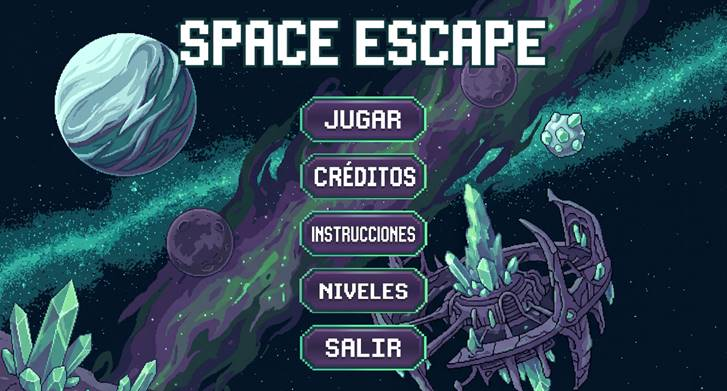

&nbsp;

<b><i>6.2. Pantalla 2: Pantalla de créditos</i></b>

<b>Objetivo:</b> mostrar los autores.

<b>Formato:</b>

•&nbsp;&nbsp;&nbsp;&nbsp;&nbsp;&nbsp;
Ventana
con información textual sobre los autores del juego.

<b>Interacción
del usuario:</b>

•&nbsp;&nbsp;&nbsp;&nbsp;&nbsp;&nbsp;
Cerrar la
ventana mediante el boton &quot;ATRÁS&quot;.

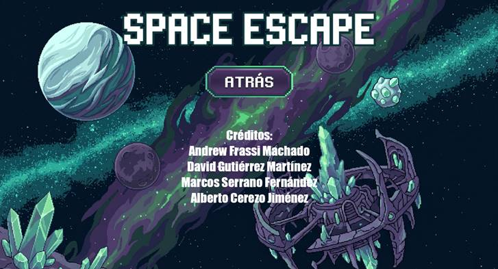

&nbsp;

<b><i>6.3. Pantalla 3: Pantalla de instrucciones</i></b>

<b>Objetivo:</b> enseñar al jugador las
mecánicas del juego.

<b>Formato:</b>

•&nbsp;&nbsp;&nbsp;&nbsp;&nbsp;&nbsp;
Ventanas
con instrucciones textuales sobre el juego.

•&nbsp;&nbsp;&nbsp;&nbsp;&nbsp;&nbsp;
Ejemplos:

•&nbsp;&nbsp;&nbsp;&nbsp;&nbsp;&nbsp;
“Moverse:
flechas del teclado y &quot;

•&nbsp;&nbsp;&nbsp;&nbsp;&nbsp;&nbsp;
&quot;W(saltar/subir escalera),
S(bajar
escalera), ”

•&nbsp;&nbsp;&nbsp;&nbsp;&nbsp;&nbsp;
“Disparar:
espacio y Q.”

<b>Interacción
del usuario:</b>

•&nbsp;&nbsp;&nbsp;&nbsp;&nbsp;&nbsp;
Cerrar la
ventana mediante el boton &quot;ATRÁS&quot;.

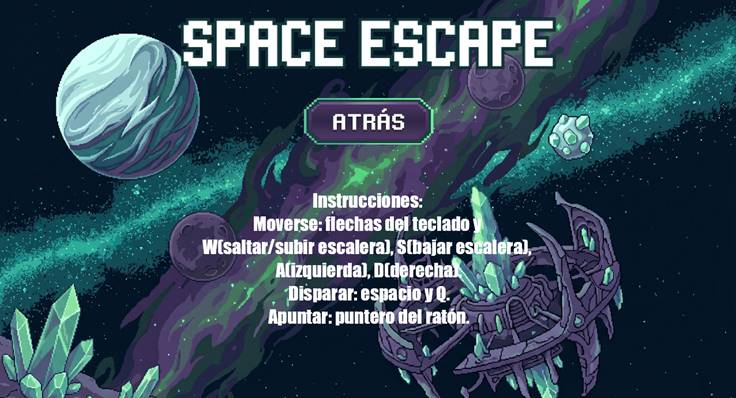

&nbsp;

<b><i>&nbsp;</i></b>

<b><i>6.4. Pantalla 4: Selección de nivel</i></b>

<b>Objetivo:</b> permitir al jugador elegir en
qué zona del planeta jugar.

<b>Elementos
en pantalla:</b>

•&nbsp;&nbsp;&nbsp;&nbsp;&nbsp;&nbsp;
<b>Lista
de niveles:</b>

•&nbsp;&nbsp;&nbsp;&nbsp;&nbsp;&nbsp;
NIVEL 1
(Zona de abducción)

•&nbsp;&nbsp;&nbsp;&nbsp;&nbsp;&nbsp;
NIVEL 2
(Zona de aterrizaje)

•&nbsp;&nbsp;&nbsp;&nbsp;&nbsp;&nbsp;
NIVEL 3
(Zonas de obras)

•&nbsp;&nbsp;&nbsp;&nbsp;&nbsp;&nbsp;
NIVEL 4
(Laboratorio abandonado)

•&nbsp;&nbsp;&nbsp;&nbsp;&nbsp;&nbsp;
NIVEL
FINAL (Base de lanzamiento alienígena)

<b>Interacción
del usuario:</b>

•&nbsp;&nbsp;&nbsp;&nbsp;&nbsp;&nbsp;
<b>Movimiento
del raton:</b>
seleccionar un nivel.

•&nbsp;&nbsp;&nbsp;&nbsp;&nbsp;&nbsp;
<b>Click
del raton:</b>
iniciar el nivel seleccionado (si está desbloqueado).

•&nbsp;&nbsp;&nbsp;&nbsp;&nbsp;&nbsp;
<b>Boton
volver atras:</b>
volver al menú principal.

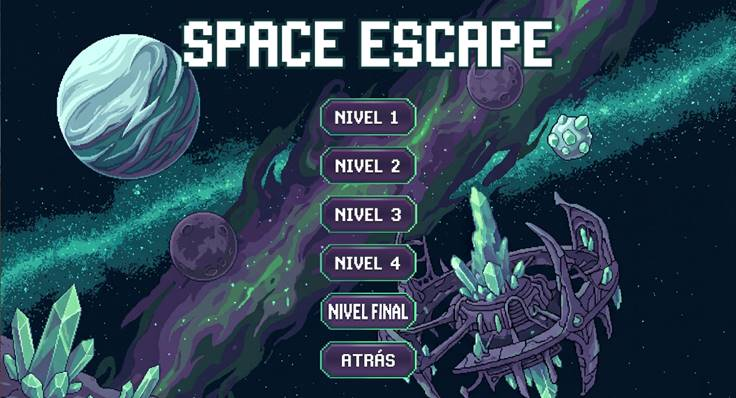

&nbsp;

&nbsp;

<b><i>6.5. Pantalla 5: Juego en curso (HUD in-game)</i></b>

<b>Objetivo:</b> mostrar la acción del juego y
la información mínima necesaria.

<b>Elementos
del HUD:</b>

•&nbsp;&nbsp;&nbsp;&nbsp;&nbsp;&nbsp;
<b>Barra
de vida:</b>
esquina superior izquierda.

•&nbsp;&nbsp;&nbsp;&nbsp;&nbsp;&nbsp;
<b>Progreso
del nivel:</b>

•&nbsp;&nbsp;&nbsp;&nbsp;&nbsp;&nbsp;
Pequeño
indicador (ej.: “Score: 10”, “Gemas azules: 1”, etc...)

<b>Interacción
del usuario:</b>

•&nbsp;&nbsp;&nbsp;&nbsp;&nbsp;&nbsp;
<b>Movimiento:</b> izquierda/derecha y teclas A
y D.

•&nbsp;&nbsp;&nbsp;&nbsp;&nbsp;&nbsp;
<b>Salto:</b> botón asignado fecha hacia
arriba y tecla W.

•&nbsp;&nbsp;&nbsp;&nbsp;&nbsp;&nbsp;
<b>Disparo:</b> botón asignado Espacio.

<b>Interacción:</b> acción cerca de objetos
(teletransportadores).

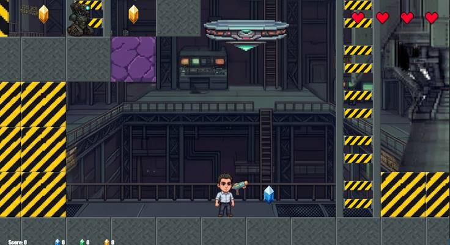

&nbsp;

<b><i>6.5.1. Pantalla 5.1: NIVEL 1</i></b>

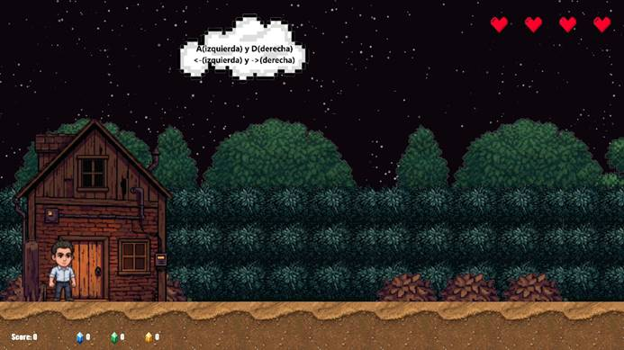

<b><i>6.5.1. Pantalla 5.1.1: NIVEL 1.1</i></b>

<b><i>6.5.2. Pantalla 5.2: NIVEL 2</i></b>

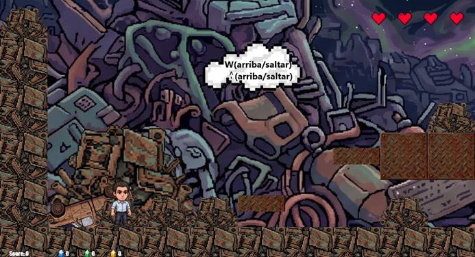

<b><i>6.5.2. Pantalla 5.2.1: REGOGIDA ARMA</i></b>

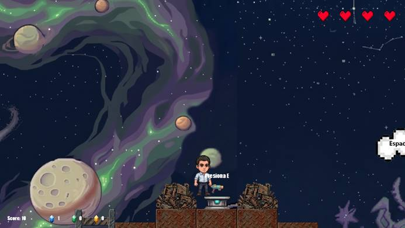

<b><i>6.5.3. Pantalla 5.3: NIVEL 3</i></b>

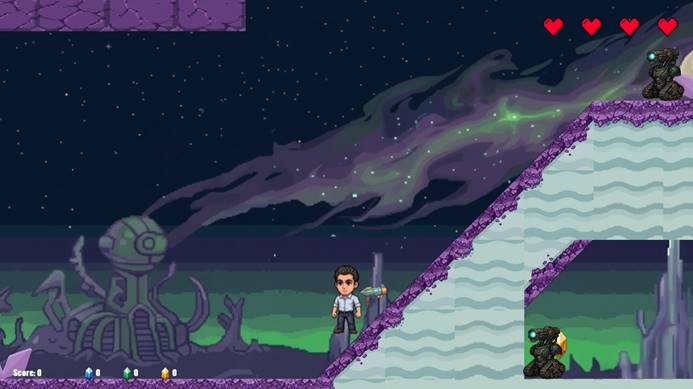

<b><i>6.5.3. Pantalla 5.3.1: GRUA/OBRAS</i></b>

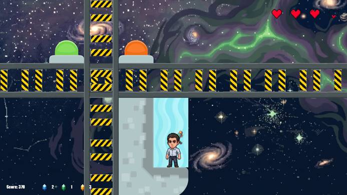

<b><i>6.5.4. Pantalla 5.4: NIVEL 4</i></b>

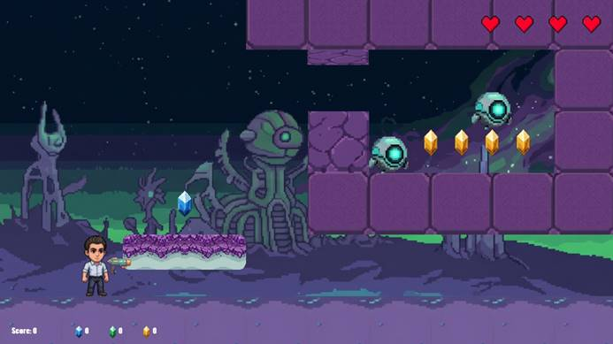

<b><i>6.5.4. Pantalla 5.4.1: LABORATORIO</i></b>

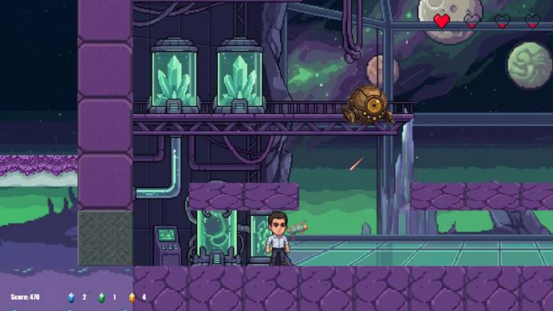

<b><i>6.5.5. Pantalla 5.5: NIVEL FINAL</i></b>

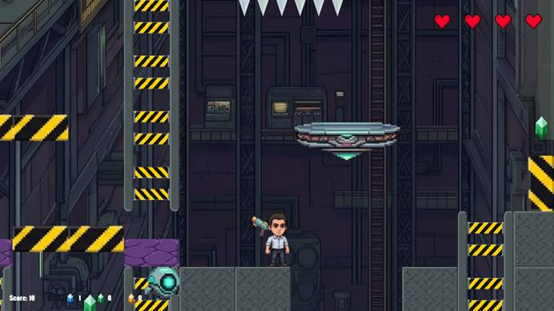

<b><i>6.5.5. Pantalla 5.5.1: ENFRENTAMIENTO FINAL</i></b>

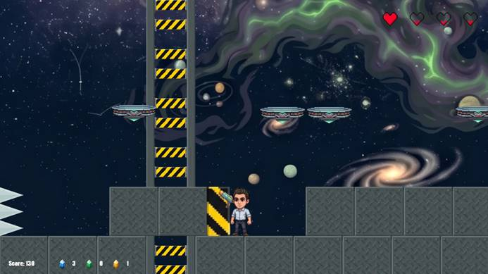

&nbsp;

&nbsp;

<b><i>6.6. Pantalla 6: Game Over</i></b>

<b>Objetivo:</b> informar que el jugador ha
perdido y ofrecer opciones de reintentar nivel.

<b>Elementos:</b>

•&nbsp;&nbsp;&nbsp;&nbsp;&nbsp;&nbsp;
Texto
central grande: <b>“GAME OVER”</b>.

•&nbsp;&nbsp;&nbsp;&nbsp;&nbsp;&nbsp;
Opciones:

•&nbsp;&nbsp;&nbsp;&nbsp;&nbsp;&nbsp;
<b>Reintentar
nivel</b>

<b>Interacción
del usuario:</b>

•&nbsp;&nbsp;&nbsp;&nbsp;&nbsp;&nbsp;
Clicar
botón izquierdo ratón para reiniciar el nivel.

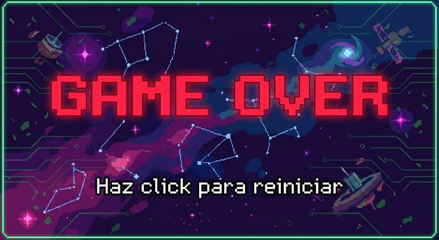

&nbsp;

<b><i>6.7.
Pantalla 7: Pantalla de victoria / fin de nivel</i></b>

<b>Objetivo:</b> celebrar la victoria del
jugador, mostrar el regreso del protagonista a la tierra.

<b>Elementos:</b>

•&nbsp;&nbsp;&nbsp;&nbsp;&nbsp;&nbsp;
Texto: <b>“¡VICTORIA”</b>.

•&nbsp;&nbsp;&nbsp;&nbsp;&nbsp;&nbsp;
Cinemática
breve que muestra al personaje regresando a la tierra.

•&nbsp;&nbsp;&nbsp;&nbsp;&nbsp;&nbsp;
Botones:

•&nbsp;&nbsp;&nbsp;&nbsp;&nbsp;&nbsp;
<b>Click
para volver al menú principal.</b>

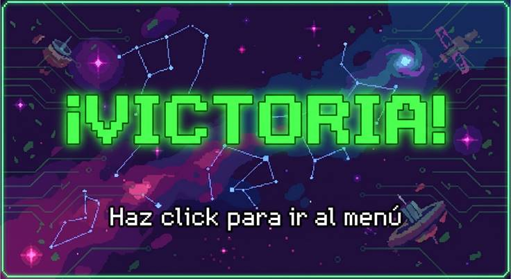

&nbsp;

&nbsp;

&nbsp;

</body>

</html>
