<html>

<head>
<meta http-equiv=Content-Type content="text/html; charset=windows-1252">
<meta name=Generator content="Microsoft Word 15 (filtered)">
<title>Microsoft Word - 2010 05 04 Modelo de Plan de Negocio.doc</title>

</head>

<body lang=ES link="#0563C1" vlink="#954F72">

SPACE
ESCAPE

LABORATORIO TECNOLOGIA DE
VIDEOJUEGOS

&nbsp;

&nbsp;

&nbsp;

&nbsp;

<b>SPACE ESCAPE</b>

<b><i>&nbsp;</i></b>

<b><i>Curso
2025/26</i></b>

<b><i>Memoria
del proyecto</i></b>

&nbsp;

29 de mayo de 2026

&nbsp;

<b>Autores</b>

Andrew Frassi Machado

David Gutiérrez Martínez

Marcos Serrano Fernández

Alberto Cerezo Jiménez

 

Contenido

<a href="#_Toc231174524">1. MEMBROS DEL EQUIPO Y ROLES. 5</a>

<a href="#_Toc231174525">2.  COMO EL
EQUIPO SE HA ORGANIZADO.. 5</a>

<a href="#_Toc231174526">2.1.
Organización del Equipo de Desarrollo. 5</a>

<a href="#_Toc231174527">2.2.
Estructura del equipo y roles asignados. 5</a>

<a href="#_Toc231174528">2.3.
Metodología de trabajo. 6</a>

<a href="#_Toc231174529">2.4.
Comunicación y herramientas utilizadas. 6</a>

<a href="#_Toc231174530">2.5.
Conclusión.. 7</a>

<a href="#_Toc231174531">3. ESQUEMA
PREVISTO DEL JUEGO (DOCUMENTO DE DISENO DEL VIDEOJUEGO – GDD). 7</a>

<a href="#_Toc231174532">3.1. Nombre
del juego. 7</a>

<a href="#_Toc231174533">3.2. Género
/ Subtipo. 7</a>

<a href="#_Toc231174534">3.3.
Historia y objetivos. 7</a>

<a href="#_Toc231174535">Contexto
narrativo. 7</a>

<a href="#_Toc231174536">Objetivo
general 8</a>

<a href="#_Toc231174537">3.4.
Estructura narrativa. 8</a>

<a href="#_Toc231174538">3.4.
Personajes (elementos). 8</a>

<a href="#_Toc231174539">3.4.1.
Personaje jugador. 8</a>

<a href="#_Toc231174540">3.4.2.
Enemigos. 9</a>

<a href="#_Toc231174541">3.5.
Elementos del entorno. 9</a>

<a href="#_Toc231174542">3.6.
Estética. 9</a>

<a href="#_Toc231174543">3.7.
Mecánicas. 10</a>

<a href="#_Toc231174544">3.7.1.
Movimiento. 10</a>

<a href="#_Toc231174545">3.7.2.
Interacción con el entorno. 10</a>

<a href="#_Toc231174546">3.7.3.
Combate. 10</a>

<a href="#_Toc231174547">3.7.4.
Progresión.. 10</a>

<a href="#_Toc231174548">3.8.
Escenarios. 10</a>

<a href="#_Toc231174549">3.8.1. Zona
de abducción.. 10</a>

<a href="#_Toc231174550">3.8.2. Zona
de aterrizaje. 11</a>

<a href="#_Toc231174551">3.8.3. Zonas
de obras. 11</a>

<a href="#_Toc231174552">3.8.4.
Laboratorio abandonado. 11</a>

<a href="#_Toc231174553">3.8.5. Base
de lanzamiento alienígena. 11</a>

<a href="#_Toc231174554">4. GRADO DE
IMPLEMENTACION DEL DOCUMENTO DE DISEÑO DEL VIDEOJUEGO (GDD). 11</a>

<a href="#_Toc231174555">4.1.
Personajes (elementos). 12</a>

<a href="#_Toc231174556">4.1.1.
Personaje jugador. 12</a>

<a href="#_Toc231174557">4.1.2.
Enemigos. 12</a>

<a href="#_Toc231174558">4.2.
Elementos del entorno. 13</a>

<a href="#_Toc231174559">4.3.
Estética. 13</a>

<a href="#_Toc231174560">4.4.
Mecánicas. 14</a>

<a href="#_Toc231174561">4.4.1.
Movimiento. 14</a>

<a href="#_Toc231174562">4.4.2.
Interacción con el entorno. 14</a>

<a href="#_Toc231174563">4.4.3.
Combate. 14</a>

<a href="#_Toc231174564">4.4.3.
Progresión.. 15</a>

<a href="#_Toc231174565">4.5.
Escenarios. 15</a>

<a href="#_Toc231174566">4.6.
Conclusión general del grado de realización del GDD.. 16</a>

<a href="#_Toc231174567">5.
EXPLICACION DE PORQUE EL DOCUMENTO DE DISENO DEL VIDEOJUEGO NO HA SIDO
COMPLETAMENTE IMPLEMENTADO.. 16</a>

<a href="#_Toc231174568">6. ASPECTOS
TECNICOS DEL PROYECTO A SER CONSIDERADO.. 16</a>

<a href="#_Toc231174569">6.1.
Arquitectura del motor y estructura del proyecto. 17</a>

<a href="#_Toc231174570">6.2. Sistema
de colisiones y físicas. 17</a>

<a href="#_Toc231174571">6.3
Controlador del jugador. 17</a>

<a href="#_Toc231174572">6.4.
Inteligencia artificial de enemigos. 18</a>

<a href="#_Toc231174573">6.5. Sistema
de interfaz (HUD). 19</a>

<a href="#_Toc231174574">6.6. Gestión
de niveles y elementos interactivos. 19</a>

<a href="#_Toc231174575">6.7.
Optimización y rendimiento. 20</a>

<a href="#_Toc231174576">6.8.
Limitaciones técnicas y de tiempo. 20</a>

<a href="#_Toc231174577">6.9.
Conclusión.. 20</a>

<a href="#_Toc231174578">7.
INFORMACION ADICIONAL DEL PROYECTO.. 21</a>

<a href="#_Toc231174579">7.1.
Estructura del repositorio. 21</a>

<a href="#_Toc231174580">7.2. Cómo
ejecutar el proyecto. 21</a>

<a href="#_Toc231174581">7.3. Roadmap
del proyecto. 21</a>

<a href="#_Toc231174582">&#9989; Versión 1.0 —
Versión inicial (Producto Mínimo Viable). 22</a>

<a href="#_Toc231174583">&#128679; Versión 1.1
— Expansión de mecánicas. 22</a>

<a href="#_Toc231174584">&#129514; Versión 1.2 —
Pulido y optimización.. 22</a>

<a href="#_Toc231174585">&#128640; Versión 2.0
— Versión final 22</a>

<a href="#_Toc231174586">7.4. Autores. 22</a>

<a href="#_Toc231174587">7.5.
Documentación.. 22</a>

<a href="#_Toc231174588">8. MAPA
CONCEPTUAL.. 23</a>

<a href="#_Toc231174589">8.1. Mapa
conceptual general de SPACE ESCAPE.. 23</a>

<a href="#_Toc231174590">8.2. Niveles. 23</a>

<a href="#_Toc231174591">8.3.
Enemigos. 24</a>

<a href="#_Toc231174592">8.4.
Mecánicas avanzadas. 24</a>

<a href="#_Toc231174593">8.5. Bocetos
de pantallas (ascii). 24</a>

<a href="#_Toc231174594">8.5.1.
Pantalla de inicio. 24</a>

<a href="#_Toc231174595">8.5.2.
Pantalla de niveles. 25</a>

<a href="#_Toc231174596">8.5.3.
Pantalla de nivel lateral 25</a>

<a href="#_Toc231174597">8.5.4.
Pantalla vertical (Zona de obras). 25</a>

<a href="#_Toc231174598">8.5.5.
Pantalla de Equipamientos alienígenas abandonados. 26</a>

<a href="#_Toc231174599">8.5.6. Base
de lanzamiento alienígena. 26</a>

<a href="#_Toc231174600">9. ANÁLISIS
Y DISEÑO DE LA APLICACIÓN... 26</a>

<a href="#_Toc231174601">9.1. Clase
principal: jugador y enemigos. 27</a>

<a href="#_Toc231174602">9.2. Clase
general de enemigos voladores. 28</a>

<a href="#_Toc231174603">9.3. Clase
general de enemigos terrestres. 28</a>

<a href="#_Toc231174604">9.4. Clase
general del arma. 28</a>

<a href="#_Toc231174605">9.5.
Sistemas especiales. 29</a>

<a href="#_Toc231174606">9.6. Clases
de las interfaces. 29</a>

<a href="#_Toc231174607">9.7. Clase
principal: Gameview... 30</a>

<a href="#_Toc231174608">9.8.
Relaciones uml (resumen). 31</a>

<a href="#_Toc231174609">10.
ESPECIFICACIÓN DE REQUISITOS. 32</a>

<a href="#_Toc231174610">10.1.
Actores del sistema. 32</a>

<a href="#_Toc231174611">10.2. Casos
de uso principales. 32</a>

<a href="#_Toc231174612">10.2.1.
Controlar al personaje. 32</a>

<a href="#_Toc231174613">10.2.2.
Explorar niveles. 32</a>

<a href="#_Toc231174614">10.2.3.
Enfrentar enemigos. 33</a>

<a href="#_Toc231174615">10.2.4.
Activar mecanismos. 33</a>

<a href="#_Toc231174616">10.2.5.
Gestionar recursos. 33</a>

<a href="#_Toc231174617">10.2.6.
Progresar en la historia. 33</a>

<a href="#_Toc231174618">10.3.
Diagrama UML de Casos de Uso (PlantUML). 34</a>

<a href="#_Toc231174619">11.
IMPLEMENTACIÓN... 35</a>

<a href="#_Toc231174620">11.1.
Estructura del Proyecto. 36</a>

<a href="#_Toc231174621">11.2.
Contenido de la documentación.. 36</a>

<a href="#_Toc231174622">12. MANUAL
DE USUARIO (DESCRIPCIÓN DEL FUNCIONAMIENTO). 37</a>

<a href="#_Toc231174623">12.1.
Pantalla 1: Título y menú principal 37</a>

<a href="#_Toc231174624">12.2. Pantalla
2: Pantalla de créditos. 38</a>

<a href="#_Toc231174625">12.3.
Pantalla 3: Pantalla de instrucciones. 39</a>

<a href="#_Toc231174626">12.4.
Pantalla 4: Selección de nivel 39</a>

<a href="#_Toc231174627">12.5.
Pantalla 5: Juego en curso (HUD in-game). 40</a>

<a href="#_Toc231174628">12.5.1.
Pantalla 5.1: NIVEL 1. 41</a>

<a href="#_Toc231174629">12.5.2.
Pantalla 5.2: NIVEL 2. 42</a>

<a href="#_Toc231174630">12.5.3.
Pantalla 5.3: NIVEL 3. 43</a>

<a href="#_Toc231174631">12.5.4.
Pantalla 5.4: NIVEL 4. 44</a>

<a href="#_Toc231174632">12.5.5.
Pantalla 5.5: NIVEL FINAL.. 45</a>

<a href="#_Toc231174633">12.6.
Pantalla 6: Game Over. 46</a>

<a href="#_Toc231174634">12.7.
Pantalla 7: Pantalla de victoria / fin de nivel 47</a>

<a href="#_Toc231174635">13. PROYECTO.. 48</a>

&nbsp;

<h1><strong>&nbsp;</strong></h1>

&nbsp;

&nbsp;

&nbsp;

&nbsp;

&nbsp;

&nbsp;

&nbsp;

&nbsp;

&nbsp;

&nbsp;

&nbsp;

&nbsp;

&nbsp;

&nbsp;

&nbsp;

&nbsp;

&nbsp;

&nbsp;

&nbsp;

&nbsp;

&nbsp;

&nbsp;

&nbsp;

&nbsp;

&nbsp;

<h1><a name="_Toc231174524"><strong>1.
MEMBROS DEL EQUIPO Y ROLES</strong></a></h1>

&nbsp;

Miembro                                         Roles

Andrew Frassi Machado                 Programación,
Jefe de Proyecto y diseño grafico

David Gutiérrez Martínez              
Programación y diseño gráfico

Marcos Serrano Fernández             Programación
y diseño de niveles

Alberto Cerezo Jiménez                 Programación, 
sonido y prueba

&nbsp;

<h1><a name="_Toc231174525">2.  COMO EL EQUIPO SE HA ORGANIZADO</a></h1>

&nbsp;

<h2><a name="_Toc231174526">2.1. Organización del Equipo de Desarrollo</a></h2>

Para la creación del videojuego SPACE ESCAPE, el
equipo estuvo compuesto por cuatro miembros que asumieron roles complementarios
con el objetivo de cubrir todas las áreas necesarias para el desarrollo de un
proyecto de este tipo. La organización se basó en una distribución clara de
responsabilidades, una comunicación constante y una metodología de trabajo
colaborativa que permitió avanzar de forma eficiente en cada fase del proyecto.

&nbsp;

<h2><a name="_Toc231174527">2.2. Estructura del equipo y roles asignados</a></h2>

&nbsp;

Andrew Frassi Machado – Programación, Jefe de
Proyecto y Diseño Gráfico  

Este miembro asumió la coordinación general del
proyecto, actuando como enlace entre las distintas áreas y asegurando que las
tareas se cumplieran dentro de los plazos establecidos. Además, participó
activamente en la programación del videojuego y en la creación de elementos
gráficos, especialmente en la definición del estilo visual y la coherencia
estética del juego.

&nbsp;

David Gutiérrez Martínez – Programación y Diseño
Gráfico  

Su labor se centró en el desarrollo de
funcionalidades del juego y en la implementación de mecánicas específicas.
También colaboró en la elaboración de recursos visuales, contribuyendo a la creación
de sprites, interfaces y elementos gráficos necesarios para reforzar la
ambientación futurista del juego.

&nbsp;

Marcos Serrano Fernández – Programación y Diseño
de Niveles  

Este miembro se encargó de diseñar la estructura
y progresión de los niveles, definiendo la disposición de obstáculos, enemigos
y elementos interactivos. Además, apoyó en tareas de programación relacionadas
con la lógica de juego y el comportamiento de los niveles.

&nbsp;

Alberto Cerezo Jiménez – Programación, Sonido y
Pruebas  

Su participación combinó la implementación de
código con la creación y edición de efectos de sonido, fundamentales para
transmitir la sensación de peligro y movimiento constante que caracteriza a
SPACE ESCAPE. También lideró las sesiones de prueba, identificando errores,
proponiendo mejoras y asegurando la estabilidad del producto final.

&nbsp;

<h2><a name="_Toc231174528">2.3. Metodología de trabajo</a></h2>

El equipo adoptó una metodología de trabajo
basada en iteraciones, organizando el desarrollo en pequeñas fases que
permitían revisar avances y corregir los errores de manera continua. Las
reuniones periódicas, tanto presenciales en el aula de la universidad como
virtuales mediante el Blackboard, facilitaron la coordinación entre los
miembros y permitieron ajustar prioridades según las necesidades del proyecto.

&nbsp;

Cada integrante trabajó en su área principal,
pero se fomentó la colaboración transversal, especialmente en programación,
donde todos los miembros aportaron código y revisaron el trabajo de los demás
para mantener la coherencia del proyecto.

&nbsp;

<h2><a name="_Toc231174529">2.4. Comunicación y herramientas utilizadas</a></h2>

Para garantizar una comunicación fluida, el
equipo empleó herramientas digitales como grupos de mensajería de la plataforma
Blackboard y el repositorio compartido de control de versiones de la plataforma
GitHub. Estas herramientas permitieron mantener un registro claro de los
avances, compartir recursos y resolver dudas de manera rápida.

&nbsp;

&nbsp;

<h2><a name="_Toc231174530">2.5. Conclusión</a></h2>

La organización del equipo fue un factor clave
para el desarrollo exitoso de SPACE ESCAPE. La combinación de roles bien
definidos, una comunicación constante y una metodología colaborativa permitió
que cada miembro aportara sus habilidades de manera efectiva, logrando un
videojuego cohesionado tanto en su jugabilidad como en su estética.

&nbsp;

<h1><a name="_Toc231174531"><strong>3. ESQUEMA PREVISTO DEL JUEGO (DOCUMENTO
DE DISENO DEL VIDEOJUEGO – GDD)</strong></a><strong>
</strong></h1>

<h2><a name="_Toc231174532"><strong>3.1.
Nombre del juego</strong></a></h2>

<strong>SPACE
ESCAPE</strong>
es un videojuego que intenta transmitir al jugador una situación de peligro y
movimiento constante. La palabra <em><b>Space</b></em> sitúa al
jugador en un entorno desconocido y hostil, mientras que <em><b>Escape</b></em> deja claro
el objetivo principal del juego: sobrevivir y huir. El nombre funciona bien en
pantallas de tipo <b><i>arcade</i></b>, es fácil de recordar y permite crear
logotipos estilizados con tipografías futuristas.

<h2><a name="_Toc231174533"><strong>3.2.
Género / Subtipo</strong></a></h2>

<strong>Género:</strong> Se trata de un
juego de plataformas con saltos y perspectiva lateral. 

<strong>Subtipo:</strong> Es un juego
de acción estilo <i>arcade</i> con énfasis en la movilidad, la esquiva y los disparos.

El
juego combina:

·&nbsp;&nbsp;&nbsp;&nbsp;&nbsp;&nbsp;&nbsp;
Precisión
de plataformas clásicas (saltos, sincronización y obstáculos).

·&nbsp;&nbsp;&nbsp;&nbsp;&nbsp;&nbsp;&nbsp;
Combate
ligero con proyectiles.

·&nbsp;&nbsp;&nbsp;&nbsp;&nbsp;&nbsp;&nbsp;
Ritmo
rápido típico de un juego <i>arcade</i>, con niveles cortos pero intensos.

·&nbsp;&nbsp;&nbsp;&nbsp;&nbsp;&nbsp;&nbsp;
Lectura
visual clara gracias a la cámara lateral, que permite anticipar peligros.

El
diseño favorece las partidas dinámicas, con enemigos que obligan al jugador a
moverse constantemente y escenarios que cambian de forma activa mediante
plataformas móviles, trampas y mecanismos alienígenas.

<h2><a name="_Toc231174534"><strong>3.3.
Historia y objetivos</strong></a></h2>

<h3><a name="_Toc231174535"><strong>Contexto narrativo</strong></a></h3>

El
protagonista es una persona común que, durante una noche tranquila, es abducido
accidentalmente por una nave alienígena. La nave lo transporta al <b><i>espacio</i></b>,
a un planeta desconocido lleno de ruinas tecnológicas, fauna agresiva y
sistemas de defensa fuera de control.

El
planeta parece haber sido abandonado hace siglos, pero sus máquinas siguen
activas, operando sin supervisión y atacando cualquier forma de vida.

<h3><a name="_Toc231174536"><strong>Objetivo general</strong></a></h3>

El
objetivo principal del juego es <b><i>escapar</i></b> del planeta superando
zonas peligrosas, derrotando a los enemigos y activando teletransportadores
alienígenas que desbloquean nuevas fases.

<h2><a name="_Toc231174537"><strong>3.4.
Estructura narrativa</strong></a></h2>

<h4><strong>Introducción</strong></h4>

·&nbsp;&nbsp;&nbsp;&nbsp;&nbsp;&nbsp;&nbsp;
Cinemática
inicial: el protagonista es abducido y transportado a un planeta alienígena.

<h4><strong>Desarrollo</strong></h4>

·&nbsp;&nbsp;&nbsp;&nbsp;&nbsp;&nbsp;&nbsp;
El
primer nivel es un breve tutorial en el planeta alienígena.

·&nbsp;&nbsp;&nbsp;&nbsp;&nbsp;&nbsp;&nbsp;
Se
enseñan las mecánicas básicas tales como caminar, saltar, disparar, usar las plataformas
y activar los teletransportadores.

·&nbsp;&nbsp;&nbsp;&nbsp;&nbsp;&nbsp;&nbsp;
Se
introduce el bláster.

·&nbsp;&nbsp;&nbsp;&nbsp;&nbsp;&nbsp;&nbsp;
El
jugador explora varias regiones del planeta, cada una con una estética y
mecánicas propias.

·&nbsp;&nbsp;&nbsp;&nbsp;&nbsp;&nbsp;&nbsp;
Aparecen
enemigos terrestres y voladores, aún más complejos y con patrones variados.

·&nbsp;&nbsp;&nbsp;&nbsp;&nbsp;&nbsp;&nbsp;
Se
introducen plataformas móviles, ascensores, grúas, teletransportadores y
trampas.

·&nbsp;&nbsp;&nbsp;&nbsp;&nbsp;&nbsp;&nbsp;
El
jugador debe recolectar gemas o activar mecanismos como los teletransportadores
para avanzar.

·&nbsp;&nbsp;&nbsp;&nbsp;&nbsp;&nbsp;&nbsp;
La
dificultad aumenta gradualmente con nuevos tipos de enemigos con muchos retos que
requieren de precisión.

<h4><strong>Conclusión</strong></h4>

·&nbsp;&nbsp;&nbsp;&nbsp;&nbsp;&nbsp;&nbsp;
El
jugador llega a la base de lanzamiento, donde se encuentra el cohete de escape.

·&nbsp;&nbsp;&nbsp;&nbsp;&nbsp;&nbsp;&nbsp;
Enfrenta
 a un enemigo final y un desafío mayor (por ejemplo, un núcleo de defensa
planetaria).

·&nbsp;&nbsp;&nbsp;&nbsp;&nbsp;&nbsp;&nbsp;
Tras
superar este último obstáculo, el jugador accede a la cápsula del cohete
espacial y escapa del planeta.

·&nbsp;&nbsp;&nbsp;&nbsp;&nbsp;&nbsp;&nbsp;
Cinemática
final: regreso a la Tierra. 

<b>Nota:</b> Se plantea implementar
una posible secuela.

<h2><a name="_Toc231174538"><strong>3.4.
Personajes (elementos)</strong></a></h2>

<h3><a name="_Toc231174539"><strong>3.4.1. Personaje jugador</strong></a></h3>

·&nbsp;&nbsp;&nbsp;&nbsp;&nbsp;&nbsp;&nbsp;
Se
trata de un humano común abducido por alienígenas y trasladado a un planeta
hostil

·&nbsp;&nbsp;&nbsp;&nbsp;&nbsp;&nbsp;&nbsp;
Habilidades:

o&nbsp;&nbsp;
El
jugador puede caminar, correr, saltar y subir por escaleras.

o&nbsp;&nbsp;
Disparar
con un bláster de energía.

o&nbsp;&nbsp;
Colgarse
de bordes, trepar columnas y deslizarse por cables o grúas.

o&nbsp;&nbsp;
Activar
dispositivos alienígenos como los teletransportadores y plataformas.

·&nbsp;&nbsp;&nbsp;&nbsp;&nbsp;&nbsp;&nbsp;
Arma
principal: bláster de energía de corto alcance, con posibilidad de mejoras
temporales (disparo doble, triple y proyectil de haz perforante).

&nbsp;

<h3><a name="_Toc231174540"><strong>3.4.2. Enemigos</strong></a></h3>

&nbsp;

<h4><strong>Voladores</strong></h4>

·&nbsp;&nbsp;&nbsp;&nbsp;&nbsp;&nbsp;&nbsp;
<strong>Drones
alienígenas:</strong>
patrullan con rutas fijas, detectan al jugador y disparan ráfagas cortas.

·&nbsp;&nbsp;&nbsp;&nbsp;&nbsp;&nbsp;&nbsp;
<strong>Robots
esféricos:</strong>
flotan lentamente y disparan proyectiles teledirigidos.

<h4><strong>Superficiales</strong></h4>

·&nbsp;&nbsp;&nbsp;&nbsp;&nbsp;&nbsp;&nbsp;
<strong>Robots
caminantes:</strong>
bloquean los pasillos, tienen armadura resistente y disparan cuerpo a cuerpo.

·&nbsp;&nbsp;&nbsp;&nbsp;&nbsp;&nbsp;&nbsp;
<strong>Torres
defensivas:</strong>
fijas, detectan movimiento del personaje y disparan láseres precisos.

<h2><a name="_Toc231174541"><strong>3.5.
Elementos del entorno</strong></a></h2>

·&nbsp;&nbsp;&nbsp;&nbsp;&nbsp;&nbsp;&nbsp;
<strong>Plataformas
destructibles:</strong>
se rompen al recibir daño.

·&nbsp;&nbsp;&nbsp;&nbsp;&nbsp;&nbsp;&nbsp;
<strong>Plataformas
indestructibles:</strong>
base del nivel, usadas para los saltos principales.

·&nbsp;&nbsp;&nbsp;&nbsp;&nbsp;&nbsp;&nbsp;
<strong>Escaleras,
ascensores, grúas y columnas:</strong> permiten una movilidad vertical y
horizontal.

·&nbsp;&nbsp;&nbsp;&nbsp;&nbsp;&nbsp;&nbsp;
<strong>Teletransportadores:</strong> cambian al
jugador de zona o de fase.

·&nbsp;&nbsp;&nbsp;&nbsp;&nbsp;&nbsp;&nbsp;
<strong>Objetos
coleccionables:</strong>
gemas (energía), mejoras temporales (velocidad, disparo, escudo).

<h2><a name="_Toc231174542"><strong>3.6.
Estética</strong></a></h2>

·&nbsp;&nbsp;&nbsp;&nbsp;&nbsp;&nbsp;&nbsp;
Se
trata de un videojuego estilo visual <strong>2D pixel art</strong>, inspirado
en juegos arcades retro pero con animaciones fluidas y efectos modernos.

·&nbsp;&nbsp;&nbsp;&nbsp;&nbsp;&nbsp;&nbsp;
Paleta
de colores vibrante, con predominio de tonos neón, luces pulsantes y metales desgastados.

·&nbsp;&nbsp;&nbsp;&nbsp;&nbsp;&nbsp;&nbsp;
Las
plataformas y elementos del escenario siguen una <strong>cuadrícula
modular de 128x128 píxeles</strong>, facilitando la construcción de
niveles.

·&nbsp;&nbsp;&nbsp;&nbsp;&nbsp;&nbsp;&nbsp;
Fondos
compuestos de:

o&nbsp;&nbsp;
Estrellas
y nebulosas.

o&nbsp;&nbsp;
Lunas
múltiples.

o&nbsp;&nbsp;
Estructuras
alienígenas gigantes.

·&nbsp;&nbsp;&nbsp;&nbsp;&nbsp;&nbsp;&nbsp;
Interfaz
minimalista:

o&nbsp;&nbsp;
Barra
de vida.

o&nbsp;&nbsp;
Indicador
de munición o energía.

o&nbsp;&nbsp;
Progreso
del nivel o número de gemas recolectadas.

o&nbsp;&nbsp;
Naves
destruidas

&nbsp;

<h2><a name="_Toc231174543"><strong>3.7.
Mecánicas</strong></a></h2>

<h3><a name="_Toc231174544"><strong>3.7.1. Movimiento</strong></a></h3>

·&nbsp;&nbsp;&nbsp;&nbsp;&nbsp;&nbsp;&nbsp;
Caminar
y correr.

·&nbsp;&nbsp;&nbsp;&nbsp;&nbsp;&nbsp;&nbsp;
Saltos
simples.

·&nbsp;&nbsp;&nbsp;&nbsp;&nbsp;&nbsp;&nbsp;
Caída
controlada en superficies (por ejemplo, plataformas).

<h3><a name="_Toc231174545"><strong>3.7.2. Interacción con el entorno</strong></a></h3>

·&nbsp;&nbsp;&nbsp;&nbsp;&nbsp;&nbsp;&nbsp;
Plataformas
móviles horizontales y verticales.

·&nbsp;&nbsp;&nbsp;&nbsp;&nbsp;&nbsp;&nbsp;
Escaleras
para ascenso y descenso manual.

·&nbsp;&nbsp;&nbsp;&nbsp;&nbsp;&nbsp;&nbsp;
Ascensores
automáticos o activados por interruptores.

·&nbsp;&nbsp;&nbsp;&nbsp;&nbsp;&nbsp;&nbsp;
Grúas
y columnas para colgarse, deslizarse o trepar.

·&nbsp;&nbsp;&nbsp;&nbsp;&nbsp;&nbsp;&nbsp;
Teletransportadores
que cambian al jugador de fase o zona.

·&nbsp;&nbsp;&nbsp;&nbsp;&nbsp;&nbsp;&nbsp;
Interruptores
que activan puertas, plataformas o mecanismos.

<h3><a name="_Toc231174546"><strong>3.7.3. Combate</strong></a></h3>

·&nbsp;&nbsp;&nbsp;&nbsp;&nbsp;&nbsp;&nbsp;
Disparo
frontal con bláster.

·&nbsp;&nbsp;&nbsp;&nbsp;&nbsp;&nbsp;&nbsp;
Mejoras
temporales:

o&nbsp;&nbsp;
Ráfaga
rápida.

o&nbsp;&nbsp;
Mayor
alcance.

o&nbsp;&nbsp;
Disparo
múltiple.

·&nbsp;&nbsp;&nbsp;&nbsp;&nbsp;&nbsp;&nbsp;
Enemigos
con patrones simples pero variados:

o&nbsp;&nbsp;
Movimiento
lineal.

o&nbsp;&nbsp;
Patrullaje.

o&nbsp;&nbsp;
Ataques
teledirigidos.

o&nbsp;&nbsp;
Explosiones
al morir.

<h3><a name="_Toc231174547"><strong>3.7.4. Progresión</strong></a></h3>

·&nbsp;&nbsp;&nbsp;&nbsp;&nbsp;&nbsp;&nbsp;
Niveles
lineales con rutas alternativas para exploración.

·&nbsp;&nbsp;&nbsp;&nbsp;&nbsp;&nbsp;&nbsp;
Recolección
de gemas para mejorar la salud.

·&nbsp;&nbsp;&nbsp;&nbsp;&nbsp;&nbsp;&nbsp;
Incremento
gradual de la dificultad mediante:

o&nbsp;&nbsp;
Nuevos
enemigos.

o&nbsp;&nbsp;
Plataformas
más complejas.

o&nbsp;&nbsp;
Trampas
más rápidas o precisas.

<h2><a name="_Toc231174548"><strong>3.8.
Escenarios</strong></a></h2>

El
planeta alienígena se divide en varias zonas temáticas, cada una con estética,
enemigos y mecánicas propias.

<h3><a name="_Toc231174549"><strong>3.8.1. Zona de abducción</strong></a></h3>

·&nbsp;&nbsp;&nbsp;&nbsp;&nbsp;&nbsp;&nbsp;
Zona
en el planeta tierra donde es abducido el personaje.

·&nbsp;&nbsp;&nbsp;&nbsp;&nbsp;&nbsp;&nbsp;
Presencia
de la nave que realiza la abducción.

<h3><a name="_Toc231174550"><strong>3.8.2. Zona de aterrizaje</strong></a></h3>

·&nbsp;&nbsp;&nbsp;&nbsp;&nbsp;&nbsp;&nbsp;
Nave
desde la que llega al planeta hostil.

·&nbsp;&nbsp;&nbsp;&nbsp;&nbsp;&nbsp;&nbsp;
Planetas
en el horizonte.

·&nbsp;&nbsp;&nbsp;&nbsp;&nbsp;&nbsp;&nbsp;
Nivel
tutorial.

·&nbsp;&nbsp;&nbsp;&nbsp;&nbsp;&nbsp;&nbsp;
Enemigos
simples y plataformas básicas.

<h3><a name="_Toc231174551"><strong>3.8.3. Zonas de obras</strong></a></h3>

·&nbsp;&nbsp;&nbsp;&nbsp;&nbsp;&nbsp;&nbsp;
Restos
de obras, grúas, escaleras.

·&nbsp;&nbsp;&nbsp;&nbsp;&nbsp;&nbsp;&nbsp;
Edificio
en construcción. Zona abierta con plataformas móviles suspendidas.

·&nbsp;&nbsp;&nbsp;&nbsp;&nbsp;&nbsp;&nbsp;
Plataformas
naturales (raíces, troncos, hojas).

·&nbsp;&nbsp;&nbsp;&nbsp;&nbsp;&nbsp;&nbsp;
Enemigos
voladores y terrestres que se ocultan.

·&nbsp;&nbsp;&nbsp;&nbsp;&nbsp;&nbsp;&nbsp;
Nivel
vertical con escaleras, ascensores y columnas.

·&nbsp;&nbsp;&nbsp;&nbsp;&nbsp;&nbsp;&nbsp;
Enemigos
que disparan desde plataformas elevadas.

·&nbsp;&nbsp;&nbsp;&nbsp;&nbsp;&nbsp;&nbsp;
Secciones
de caída libre controlada.

·&nbsp;&nbsp;&nbsp;&nbsp;&nbsp;&nbsp;&nbsp;
Trampas
mecánicas como prensas o sierras.

<h3><a name="_Toc231174552"><strong>3.8.4. Laboratorio abandonado</strong></a></h3>

·&nbsp;&nbsp;&nbsp;&nbsp;&nbsp;&nbsp;&nbsp;
Maquinaria
en movimiento, grúas, ascensores y cintas transportadoras.

·&nbsp;&nbsp;&nbsp;&nbsp;&nbsp;&nbsp;&nbsp;
Robots
defectuosos y torres defensivas.

·&nbsp;&nbsp;&nbsp;&nbsp;&nbsp;&nbsp;&nbsp;
Enemigos
voladores predominantes.

<h3><a name="_Toc231174553"><strong>3.8.5. Base de lanzamiento alienígena</strong></a></h3>

·&nbsp;&nbsp;&nbsp;&nbsp;&nbsp;&nbsp;&nbsp;
Fase
final.

·&nbsp;&nbsp;&nbsp;&nbsp;&nbsp;&nbsp;&nbsp;
Mayor
dificultad.

·&nbsp;&nbsp;&nbsp;&nbsp;&nbsp;&nbsp;&nbsp;
Trampas
combinadas, enemigos diversos de superficie y voladores.

·&nbsp;&nbsp;&nbsp;&nbsp;&nbsp;&nbsp;&nbsp;
Enemigo
final o núcleo de defensa del planeta hostil.

&nbsp;

<h1><a name="_Toc231174554">4. GRADO DE IMPLEMENTACION DEL DOCUMENTO DE DISEÑO
DEL VIDEOJUEGO (GDD)</a> </h1>

&nbsp;

El desarrollo del videojuego SPACE ESCAPE se ha
basado en el Documento de Diseño del Videojuego (GDD) descrito previamente, que
establecía las características, mecánicas y los elementos previstos para el videojuego
final.

&nbsp;

A continuación, se detalla el grado de
cumplimiento de cada apartado, indicando qué elementos se han implementado
correctamente y cuáles no han podido desarrollarse por limitaciones de tiempo,
recursos o complejidad técnica.

&nbsp;

<h2><a name="_Toc231174555">4.1. Personajes (elementos)</a></h2>

<h3><a name="_Toc231174556">4.1.1. Personaje jugador</a></h3>

&nbsp;

<b>Implementado:</b>

&nbsp;

·&nbsp;&nbsp;&nbsp;&nbsp;&nbsp;&nbsp;&nbsp;
Movimiento
básico: caminar, correr, saltar y uso de escaleras.

·&nbsp;&nbsp;&nbsp;&nbsp;&nbsp;&nbsp;&nbsp;
Interacción
con el entorno: colgarse de bordes, trepar columnas y deslizarse por elementos
habilitados.

·&nbsp;&nbsp;&nbsp;&nbsp;&nbsp;&nbsp;&nbsp;
Activación
de dispositivos alienígenas como teletransportadores.

·&nbsp;&nbsp;&nbsp;&nbsp;&nbsp;&nbsp;&nbsp;
Arma
principal: bláster de energía funcional.

&nbsp;

<b>No implementado:</b>

&nbsp;

·&nbsp;&nbsp;&nbsp;&nbsp;&nbsp;&nbsp;&nbsp;
Mejoras
temporales del arma (disparo doble, triple, haz perforante).

&nbsp;

Estas mejoras estaban previstas para aumentar la
variedad del combate, pero no se pudieron integrar debido a la complejidad de
su programación y la necesidad de equilibrar el juego.

&nbsp;

<h3><a name="_Toc231174557">4.1.2. Enemigos</a></h3>

&nbsp;

<b>Implementado:</b>

&nbsp;

·&nbsp;&nbsp;&nbsp;&nbsp;&nbsp;&nbsp;&nbsp;
Enemigos
voladores: drones y robots esféricos con patrones básicos de movimiento y
ataque.

·&nbsp;&nbsp;&nbsp;&nbsp;&nbsp;&nbsp;&nbsp;
Enemigos
superficiales: robots caminantes funcionales.

&nbsp;

<b>No implementado:</b>

&nbsp;

·&nbsp;&nbsp;&nbsp;&nbsp;&nbsp;&nbsp;&nbsp;
Torres
defensivas fijas con detección de movimiento y disparos precisos.

&nbsp;

Este tipo de enemigo requería un sistema avanzado
de detección y disparo que no pudo completarse dentro del tiempo disponible.

&nbsp;

&nbsp;

&nbsp;

<h2><a name="_Toc231174558">4.2. Elementos del entorno</a></h2>

&nbsp;

<b>Implementado:</b>

&nbsp;

·&nbsp;&nbsp;&nbsp;&nbsp;&nbsp;&nbsp;&nbsp;
Plataformas
destructibles e indestructibles.

·&nbsp;&nbsp;&nbsp;&nbsp;&nbsp;&nbsp;&nbsp;
Escaleras,
grúas, columnas y teletransportadores.

·&nbsp;&nbsp;&nbsp;&nbsp;&nbsp;&nbsp;&nbsp;
Gemas
básicas como objetos coleccionables.

&nbsp;

<b>No implementado:</b>

&nbsp;

·&nbsp;&nbsp;&nbsp;&nbsp;&nbsp;&nbsp;&nbsp;
Gemas
o ítems de mejoras temporales (velocidad, disparo, escudo).

&nbsp;

Estas mejoras estaban previstas para ampliar la
progresión del jugador, pero no se integraron por falta de tiempo y necesidad
de priorizar mecánicas esenciales.

&nbsp;

<h2><a name="_Toc231174559">4.3. Estética</a></h2>

<b>Implementado:</b>

&nbsp;

·&nbsp;&nbsp;&nbsp;&nbsp;&nbsp;&nbsp;&nbsp;
Estilo
visual 2D pixel art.

·&nbsp;&nbsp;&nbsp;&nbsp;&nbsp;&nbsp;&nbsp;
Paleta
de colores vibrante con estética futurista.

·&nbsp;&nbsp;&nbsp;&nbsp;&nbsp;&nbsp;&nbsp;
Fondos
con elementos espaciales y estructuras alienígenas.

·&nbsp;&nbsp;&nbsp;&nbsp;&nbsp;&nbsp;&nbsp;
Interfaz
minimalista con barra de vida y elementos básicos.

&nbsp;

<b>No implementado:</b>

&nbsp;

·&nbsp;&nbsp;&nbsp;&nbsp;&nbsp;&nbsp;&nbsp;
Indicador
de munición.

·&nbsp;&nbsp;&nbsp;&nbsp;&nbsp;&nbsp;&nbsp;
Contadores
adicionales durante el nivel (naves destruidas, tiempo, estadísticas
avanzadas).

&nbsp;

Estos elementos requerían sistemas adicionales de
registro y visualización que no se pudieron completar.

&nbsp;

&nbsp;

&nbsp;

&nbsp;

<h2><a name="_Toc231174560">4.4. Mecánicas</a></h2>

&nbsp;

<h3><a name="_Toc231174561">4.4.1. Movimiento</a></h3>

&nbsp;

Implementado completamente.  

&nbsp;

El jugador puede caminar, correr, saltar y
controlar la caída sobre plataformas.

&nbsp;

<h3><a name="_Toc231174562">4.4.2. Interacción con el entorno</a></h3>

&nbsp;

<b>Implementado:</b>

&nbsp;

·&nbsp;&nbsp;&nbsp;&nbsp;&nbsp;&nbsp;&nbsp;
Plataformas
móviles.

·&nbsp;&nbsp;&nbsp;&nbsp;&nbsp;&nbsp;&nbsp;
Escaleras
y grúas.

·&nbsp;&nbsp;&nbsp;&nbsp;&nbsp;&nbsp;&nbsp;
Teletransportadores
funcionales.

&nbsp;

<b>No implementado:</b>

&nbsp;

·&nbsp;&nbsp;&nbsp;&nbsp;&nbsp;&nbsp;&nbsp;
Ascensores
activados por interruptores.

·&nbsp;&nbsp;&nbsp;&nbsp;&nbsp;&nbsp;&nbsp;
Interruptores
que activan puertas, plataformas o mecanismos.

&nbsp;

Estas mecánicas requerían sistemas de activación
y sincronización que no se pudieron desarrollar a tiempo.

&nbsp;

<h3><a name="_Toc231174563">4.4.3. Combate</a></h3>

&nbsp;

<b>Implementado:</b>

&nbsp;

·&nbsp;&nbsp;&nbsp;&nbsp;&nbsp;&nbsp;&nbsp;
Disparo
frontal básico con bláster.

·&nbsp;&nbsp;&nbsp;&nbsp;&nbsp;&nbsp;&nbsp;
Enemigos
con patrones simples de movimiento y ataque.

&nbsp;

<b>No implementado:</b>

&nbsp;

·&nbsp;&nbsp;&nbsp;&nbsp;&nbsp;&nbsp;&nbsp;
Mejoras
temporales del arma (ráfaga rápida, mayor alcance, disparo múltiple).

·&nbsp;&nbsp;&nbsp;&nbsp;&nbsp;&nbsp;&nbsp;
Nuevos
patrones de enemigos:

·&nbsp;&nbsp;&nbsp;&nbsp;&nbsp;&nbsp;&nbsp;
Patrullaje.

·&nbsp;&nbsp;&nbsp;&nbsp;&nbsp;&nbsp;&nbsp;
Explosiones
al morir.

&nbsp;

Estas funciones estaban previstas para enriquecer
el combate, pero no se implementaron por su complejidad técnica.

<h3>&nbsp;</h3>

<h3><a name="_Toc231174564">4.4.3. Progresión</a></h3>

&nbsp;

<b>Implementado:</b>

&nbsp;

·&nbsp;&nbsp;&nbsp;&nbsp;&nbsp;&nbsp;&nbsp;
Niveles
lineales con rutas alternativas.

·&nbsp;&nbsp;&nbsp;&nbsp;&nbsp;&nbsp;&nbsp;
Recolección
de gemas básicas.

·&nbsp;&nbsp;&nbsp;&nbsp;&nbsp;&nbsp;&nbsp;
Incremento
gradual de dificultad mediante diseño de niveles y aparición de enemigos.

&nbsp;

<b>No implementado:</b>

&nbsp;

·&nbsp;&nbsp;&nbsp;&nbsp;&nbsp;&nbsp;&nbsp;
Trampas
avanzadas o más rápidas en fases posteriores.

&nbsp;

<h2><a name="_Toc231174565">4.5. Escenarios</a></h2>

&nbsp;

<b>Implementado:</b>

&nbsp;

·&nbsp;&nbsp;&nbsp;&nbsp;&nbsp;&nbsp;&nbsp;
Zona
de abducción.

·&nbsp;&nbsp;&nbsp;&nbsp;&nbsp;&nbsp;&nbsp;
Zona
de aterrizaje (tutorial).

·&nbsp;&nbsp;&nbsp;&nbsp;&nbsp;&nbsp;&nbsp;
Zonas
de obras.

·&nbsp;&nbsp;&nbsp;&nbsp;&nbsp;&nbsp;&nbsp;
Base
de lanzamiento alienígena (fase final).

&nbsp;

<b>No implementado:</b>

&nbsp;

·&nbsp;&nbsp;&nbsp;&nbsp;&nbsp;&nbsp;&nbsp;
Laboratorio
abandonado con torres defensivas.

&nbsp;

Aunque parte del escenario se diseñó
conceptualmente, no se integró en el juego final debido a la falta de tiempo y
a la ausencia de las torres defensivas, que eran un elemento clave de esta
zona.

&nbsp;

&nbsp;

&nbsp;

<h2><a name="_Toc231174566">4.6. Conclusión general del grado de realización
del GDD</a></h2>

&nbsp;

El desarrollo del videojuego SPACE ESCAPE ha
logrado implementar la mayoría de las mecánicas esenciales, garantizando una
experiencia jugable completa y coherente con el diseño original.

&nbsp;

Sin embargo, varias características avanzadas, principalmente
relacionadas con mejoras temporales, enemigos complejos, sistemas de activación
y elementos de interfaz, no pudieron ser integradas debido a limitaciones de
tiempo y recursos.

&nbsp;

Aun así, el resultado final mantiene la esencia
del documento de diseño del videojuego (GDD):

&nbsp;

·&nbsp;&nbsp;&nbsp;&nbsp;&nbsp;&nbsp;&nbsp;
Un
juego de plataformas dinámico.

·&nbsp;&nbsp;&nbsp;&nbsp;&nbsp;&nbsp;&nbsp;
Acción
arcade.

·&nbsp;&nbsp;&nbsp;&nbsp;&nbsp;&nbsp;&nbsp;
Ambientación
alienígena coherente.

·&nbsp;&nbsp;&nbsp;&nbsp;&nbsp;&nbsp;&nbsp;
Progresión
clara y niveles funcionales.

&nbsp;

&nbsp;

<h1><a name="_Toc231174567">5. EXPLICACION DE PORQUE EL DOCUMENTO DE DISENO DEL
VIDEOJUEGO NO HA SIDO COMPLETAMENTE IMPLEMENTADO</a></h1>

&nbsp;

Durante el desarrollo del videojuego SPACE
ESCAPE, se planificaron diversas características avanzadas que finalmente no
pudieron integrarse en la versión final. Las razones principales están
relacionadas con limitaciones técnicas, tiempo disponible, complejidad de
implementación y priorización de funcionalidades esenciales.

&nbsp;

Las funcionalidades no implementadas comparten un
patrón común: requerían sistemas adicionales complejos o reestructurar partes
fundamentales del juego.

&nbsp;

Dado el tiempo limitado y la necesidad de
priorizar un producto funcional y estable, se optó por centrarse en las mecánicas
esenciales que garantizan una experiencia completa y coherente.

&nbsp;

<h1><a name="_Toc231174568">6. ASPECTOS TECNICOS DEL PROYECTO A SER CONSIDERADO</a></h1>

&nbsp;

El desarrollo de SPACE ESCAPE ha implicado la
integración de diversos componentes técnicos que han determinado tanto las
posibilidades como las limitaciones del videojuego final. A continuación, se
describen los principales aspectos técnicos que han influido en el proceso de
creación del videojuego.

&nbsp;

<h2><a name="_Toc231174569">6.1. Arquitectura del motor y estructura del
proyecto</a></h2>

&nbsp;

El videojuego se ha construido sobre un motor 2D (librería
arcade) que ha permitido:

&nbsp;

·&nbsp;&nbsp;&nbsp;&nbsp;&nbsp;&nbsp;&nbsp;
Gestión
de sprites y animaciones mediante hojas de sprites.

·&nbsp;&nbsp;&nbsp;&nbsp;&nbsp;&nbsp;&nbsp;
Control
de físicas básicas (gravedad, colisiones, desplazamientos).

·&nbsp;&nbsp;&nbsp;&nbsp;&nbsp;&nbsp;&nbsp;
Sistema
de escenas o niveles independientes.

·&nbsp;&nbsp;&nbsp;&nbsp;&nbsp;&nbsp;&nbsp;
Controladores
específicos para jugador, enemigos y elementos interactivos.

&nbsp;

La arquitectura se ha basado en una estructura
modular, donde cada entidad (jugador, enemigo, plataforma, objeto) posee su
propio script o controlador. Esto facilita la escalabilidad, pero también
implica que añadir nuevas mecánicas requiere ampliar o modificar varios módulos
simultáneamente.

&nbsp;

<h2><a name="_Toc231174570">6.2. Sistema de colisiones y físicas</a></h2>

El sistema de colisiones ha sido uno de los
pilares técnicos del proyecto. Se han implementado:

&nbsp;

·&nbsp;&nbsp;&nbsp;&nbsp;&nbsp;&nbsp;&nbsp;
Colisiones
entre jugador y plataformas.

·&nbsp;&nbsp;&nbsp;&nbsp;&nbsp;&nbsp;&nbsp;
Detección
de bordes para permitir agarres y trepado.

·&nbsp;&nbsp;&nbsp;&nbsp;&nbsp;&nbsp;&nbsp;
Colisiones
entre proyectiles y enemigos.

·&nbsp;&nbsp;&nbsp;&nbsp;&nbsp;&nbsp;&nbsp;
Colisiones
con elementos destructibles.

&nbsp;

Este sistema, aunque funcional, presenta
limitaciones cuando se intenta añadir mecánicas más avanzadas como:

&nbsp;

·&nbsp;&nbsp;&nbsp;&nbsp;&nbsp;&nbsp;&nbsp;
Proyectiles
con trayectorias especiales.

·&nbsp;&nbsp;&nbsp;&nbsp;&nbsp;&nbsp;&nbsp;
Enemigos
con patrones complejos.

·&nbsp;&nbsp;&nbsp;&nbsp;&nbsp;&nbsp;&nbsp;
Plataformas
activadas por interruptores.

&nbsp;

Estas características requieren un sistema de
físicas más robusto y una gestión de eventos más sofisticada.

&nbsp;

<h2><a name="_Toc231174571">6.3 Controlador del jugador</a></h2>

&nbsp;

El controlador del jugador incluye:

&nbsp;

·&nbsp;&nbsp;&nbsp;&nbsp;&nbsp;&nbsp;&nbsp;
Movimiento
horizontal con aceleración y frenado.

·&nbsp;&nbsp;&nbsp;&nbsp;&nbsp;&nbsp;&nbsp;
Saltos
con control de altura.

·&nbsp;&nbsp;&nbsp;&nbsp;&nbsp;&nbsp;&nbsp;
Detección
de escaleras y superficies trepables.

·&nbsp;&nbsp;&nbsp;&nbsp;&nbsp;&nbsp;&nbsp;
Sistema
de disparo básico.

&nbsp;

El controlador está diseñado para ser preciso y
responsivo, pero no contempla de forma nativa:

&nbsp;

·&nbsp;&nbsp;&nbsp;&nbsp;&nbsp;&nbsp;&nbsp;
Cambios
temporales en atributos (velocidad, fuerza de disparo).

·&nbsp;&nbsp;&nbsp;&nbsp;&nbsp;&nbsp;&nbsp;
Estados
avanzados como invulnerabilidad, escudos o mejoras temporales.

·&nbsp;&nbsp;&nbsp;&nbsp;&nbsp;&nbsp;&nbsp;
Variaciones
en el tipo de proyectil.

&nbsp;

Implementar estas funciones requeriría
reestructurar el controlador para soportar un sistema de estados más complejo.

&nbsp;

<h2><a name="_Toc231174572">6.4. Inteligencia artificial de enemigos</a></h2>

&nbsp;

Los enemigos implementados utilizan IA básica:

&nbsp;

·&nbsp;&nbsp;&nbsp;&nbsp;&nbsp;&nbsp;&nbsp;
Movimiento
lineal o flotante.

·&nbsp;&nbsp;&nbsp;&nbsp;&nbsp;&nbsp;&nbsp;
Detección
simple del jugador mediante colisiones o proximidad.

·&nbsp;&nbsp;&nbsp;&nbsp;&nbsp;&nbsp;&nbsp;
Ataques
directos sin predicción de trayectoria.

&nbsp;

Para implementar enemigos más avanzados
(patrullaje, torres defensivas, explosiones al morir) sería necesario:

&nbsp;

·&nbsp;&nbsp;&nbsp;&nbsp;&nbsp;&nbsp;&nbsp;
Un
sistema de waypoints o rutas predefinidas.

·&nbsp;&nbsp;&nbsp;&nbsp;&nbsp;&nbsp;&nbsp;
Algoritmos
de detección direccional (raycasting).

·&nbsp;&nbsp;&nbsp;&nbsp;&nbsp;&nbsp;&nbsp;
Gestión
de estados (patrullar, atacar, perseguir, morir).

·&nbsp;&nbsp;&nbsp;&nbsp;&nbsp;&nbsp;&nbsp;
Efectos
visuales y de daño en área.

&nbsp;

Estas características requieren una IA más
elaborada que excede el alcance del proyecto actual.

&nbsp;

<h2><a name="_Toc231174573">6.5. Sistema de interfaz (HUD)</a></h2>

&nbsp;

El HUD implementado incluye:

&nbsp;

·&nbsp;&nbsp;&nbsp;&nbsp;&nbsp;&nbsp;&nbsp;
Barra
de vida.

·&nbsp;&nbsp;&nbsp;&nbsp;&nbsp;&nbsp;&nbsp;
Indicadores
básicos de progreso.

&nbsp;

Sin embargo, no se han añadido elementos como:

&nbsp;

·&nbsp;&nbsp;&nbsp;&nbsp;&nbsp;&nbsp;&nbsp;
Indicador
de munición.

·&nbsp;&nbsp;&nbsp;&nbsp;&nbsp;&nbsp;&nbsp;
Contador
de enemigos destruidos.

·&nbsp;&nbsp;&nbsp;&nbsp;&nbsp;&nbsp;&nbsp;
Tiempo
transcurrido en el nivel.

·&nbsp;&nbsp;&nbsp;&nbsp;&nbsp;&nbsp;&nbsp;
Iconos
de mejoras temporales.

&nbsp;

La razón técnica es que estos elementos
requieren:

&nbsp;

·&nbsp;&nbsp;&nbsp;&nbsp;&nbsp;&nbsp;&nbsp;
Variables
persistentes y sincronizadas con el juego.

·&nbsp;&nbsp;&nbsp;&nbsp;&nbsp;&nbsp;&nbsp;
Eventos
que actualicen la interfaz en tiempo real.

·&nbsp;&nbsp;&nbsp;&nbsp;&nbsp;&nbsp;&nbsp;
Diseño
visual adicional.

&nbsp;

El sistema actual está pensado para simplicidad y
estabilidad.

&nbsp;

<h2><a name="_Toc231174574">6.6. Gestión de niveles y elementos interactivos</a></h2>

&nbsp;

Los niveles se han construido mediante:

&nbsp;

·&nbsp;&nbsp;&nbsp;&nbsp;&nbsp;&nbsp;&nbsp;
Tilesets
modulares.

·&nbsp;&nbsp;&nbsp;&nbsp;&nbsp;&nbsp;&nbsp;
Plataformas
móviles preconfiguradas.

·&nbsp;&nbsp;&nbsp;&nbsp;&nbsp;&nbsp;&nbsp;
Teletransportadores
funcionales.

&nbsp;

No se han implementado:

&nbsp;

·&nbsp;&nbsp;&nbsp;&nbsp;&nbsp;&nbsp;&nbsp;
Ascensores
activados por interruptores.

·&nbsp;&nbsp;&nbsp;&nbsp;&nbsp;&nbsp;&nbsp;
Puertas
o mecanismos dependientes de señales.

·&nbsp;&nbsp;&nbsp;&nbsp;&nbsp;&nbsp;&nbsp;
Sistemas
de activación en cadena.

&nbsp;

Estas funciones requieren un sistema de eventos
que permita comunicación entre objetos (interruptor &#8594; plataforma), lo
cual no estaba contemplado en la arquitectura inicial.

&nbsp;

<h2><a name="_Toc231174575">6.7. Optimización y rendimiento</a></h2>

&nbsp;

Durante el desarrollo se han considerado aspectos
como:

&nbsp;

·&nbsp;&nbsp;&nbsp;&nbsp;&nbsp;&nbsp;&nbsp;
Reducción
del número de colisiones simultáneas.

·&nbsp;&nbsp;&nbsp;&nbsp;&nbsp;&nbsp;&nbsp;
Uso
eficiente de sprites para evitar sobrecarga gráfica.

·&nbsp;&nbsp;&nbsp;&nbsp;&nbsp;&nbsp;&nbsp;
Limitación
del número de enemigos activos por nivel.

·&nbsp;&nbsp;&nbsp;&nbsp;&nbsp;&nbsp;&nbsp;
Simplificación
de efectos visuales.

&nbsp;

La prioridad ha sido mantener un rendimiento estable
en todas las plataformas objetivo.

&nbsp;

<h2><a name="_Toc231174576">6.8. Limitaciones técnicas y de tiempo</a></h2>

&nbsp;

Muchos elementos no implementados comparten
causas comunes:

&nbsp;

·&nbsp;&nbsp;&nbsp;&nbsp;&nbsp;&nbsp;&nbsp;
Falta
de tiempo para desarrollar sistemas más avanzados.

·&nbsp;&nbsp;&nbsp;&nbsp;&nbsp;&nbsp;&nbsp;
Complejidad
técnica que requería reestructurar módulos ya funcionales.

·&nbsp;&nbsp;&nbsp;&nbsp;&nbsp;&nbsp;&nbsp;
Necesidad
de priorizar jugabilidad básica y estabilidad.

·&nbsp;&nbsp;&nbsp;&nbsp;&nbsp;&nbsp;&nbsp;
Recursos
limitados para diseño de arte, animaciones y efectos.

&nbsp;

Estas limitaciones no deberían ser habituales pero
no ha afectado a la jugabilidad esencial del videojuego final.

&nbsp;

<h2><a name="_Toc231174577">6.9. Conclusión</a></h2>

&nbsp;

Los aspectos técnicos del proyecto desarrollado reflejan
un equilibrio entre ambición y viabilidad. Aunque algunas funciones avanzadas
no han podido ser implementadas, la base técnica del juego es sólida, modular y
escalable, permitiendo futuras ampliaciones si se dispone de más tiempo o
recursos.

&nbsp;

&nbsp;

<h1><a name="_Toc231174578">7. INFORMACION ADICIONAL DEL PROYECTO</a></h1>

&nbsp;

<h2><a name="_Toc231174579">7.1. Estructura del repositorio</a></h2>

<pre><code>/assets</code></pre><pre><code>    /debug</code></pre><pre><code>    /img</code></pre><pre><code>    /levels</code></pre><pre><code>    /music</code></pre><pre><code>    /sprites</code></pre><pre><code>    /videos</code></pre><pre><code>/docs</code></pre><pre><code>    gdd.md </code></pre><pre><code>    memory.md</code></pre><pre><code>/src</code></pre><pre><code>    /character</code></pre><pre><code>    /gui</code></pre><pre><code>    /webhook</code></pre><pre><code>    main.py</code></pre><pre><code>README.md</code></pre><pre><code>requirements.txt</code></pre>

&nbsp;

<h2><a name="_Toc231174580"><strong>7.2.
Cómo ejecutar el proyecto</strong></a></h2>

•&nbsp;&nbsp;&nbsp;&nbsp;&nbsp;&nbsp; Clonar el repositorio:

git clone <a
href="https://github.com/AFM-EPS/tdv-platform.git">https://github.com/AFM-EPS/tdv-platform.git</a>

•&nbsp;&nbsp;&nbsp;&nbsp;&nbsp;&nbsp; Instalar dependencias:

pip install arcade

pip install opencv-python

&nbsp;

Alternativamente se podría
utilizar los requirements:

&nbsp;

pip install –r
requirements.txt

&nbsp;

•&nbsp;&nbsp;&nbsp;&nbsp;&nbsp;&nbsp; Ejecutar el juego:

python src/main.py

<pre><code>&nbsp;</code></pre><pre><code>&nbsp;</code></pre>

<h2><a name="_Toc231174581">7.3. <strong>Roadmap
del proyecto</strong></a></h2>

&nbsp;

<h3><a name="_Toc231174582">&#9989;</a> <strong>Versión 1.0 — Versión inicial (Producto Mínimo Viable)</strong></h3>

·&nbsp;&nbsp;&nbsp;&nbsp;&nbsp;&nbsp;&nbsp;
Implementado
los movimientos básicos del jugador

·&nbsp;&nbsp;&nbsp;&nbsp;&nbsp;&nbsp;&nbsp;
Incluido
sistema de disparo con bláster

·&nbsp;&nbsp;&nbsp;&nbsp;&nbsp;&nbsp;&nbsp;
Se
ha implementado los enemigos simples (voladores y terrestres)

·&nbsp;&nbsp;&nbsp;&nbsp;&nbsp;&nbsp;&nbsp;
Se
ha creado las plataformas estáticas y móviles

·&nbsp;&nbsp;&nbsp;&nbsp;&nbsp;&nbsp;&nbsp;
Se
ha añadido un nivel tutorial funcional

·&nbsp;&nbsp;&nbsp;&nbsp;&nbsp;&nbsp;&nbsp;
Se
ha implementado un HUD básico (vida y energía)

<h3><a name="_Toc231174583">&#128679;</a> <strong>Versión 1.1 — Expansión de mecánicas</strong></h3>

·&nbsp;&nbsp;&nbsp;&nbsp;&nbsp;&nbsp;&nbsp;
Se
ha implementado mejoras del bláster

·&nbsp;&nbsp;&nbsp;&nbsp;&nbsp;&nbsp;&nbsp;
Se
ha añadido trampas mecánicas

·&nbsp;&nbsp;&nbsp;&nbsp;&nbsp;&nbsp;&nbsp;
Se
ha incluido sistema de gemas y progresión

·&nbsp;&nbsp;&nbsp;&nbsp;&nbsp;&nbsp;&nbsp;
Se
ha implementado nuevos patrones de enemigos

·&nbsp;&nbsp;&nbsp;&nbsp;&nbsp;&nbsp;&nbsp;
Se
ha incluido algunas animaciones avanzadas del jugador

<h3><a name="_Toc231174584">&#129514;</a> <strong>Versión 1.2 — Pulido y optimización</strong></h3>

·&nbsp;&nbsp;&nbsp;&nbsp;&nbsp;&nbsp;&nbsp;
Se
ha optimizado las colisiones

·&nbsp;&nbsp;&nbsp;&nbsp;&nbsp;&nbsp;&nbsp;
Se
ha ajustado la dificultad progresiva

·&nbsp;&nbsp;&nbsp;&nbsp;&nbsp;&nbsp;&nbsp;
Se
ha mejorado la interfaz/HUD

·&nbsp;&nbsp;&nbsp;&nbsp;&nbsp;&nbsp;&nbsp;
Se
ha creado efectos visuales y partículas

·&nbsp;&nbsp;&nbsp;&nbsp;&nbsp;&nbsp;&nbsp;
Se
ha producido sonido y música adaptativa

<h3><a name="_Toc231174585">&#128640;</a> <strong>Versión 2.0 — Versión final</strong></h3>

·&nbsp;&nbsp;&nbsp;&nbsp;&nbsp;&nbsp;&nbsp;
Se
ha introducido el nivel final con la presencia de una nueva Nave alienígena

·&nbsp;&nbsp;&nbsp;&nbsp;&nbsp;&nbsp;&nbsp;
Nuevas
cinemáticas de introducción y cierre

<h2><strong>&nbsp;</strong></h2>

<h2><a name="_Toc231174586"><strong>7.4.
Autores</strong></a></h2>

El
proyecto ha sido desarrollado por estudiantes de la asignatura <strong>Tecnología de Videojuegos</strong>.

<h2>&nbsp;</h2>

<h2><a name="_Toc231174587">7.5. <strong>Documentación</strong></a></h2>

·&nbsp;&nbsp;&nbsp;&nbsp;&nbsp;&nbsp;&nbsp;
<strong>Memoria
del proyecto:</strong>
<code>docs/memory.md</code>

·&nbsp;&nbsp;&nbsp;&nbsp;&nbsp;&nbsp;&nbsp;
<strong>GDD:</strong> <code>docs/gdd.md</code>

·&nbsp;&nbsp;&nbsp;&nbsp;&nbsp;&nbsp;&nbsp;
Recursos
adicionales en la carpeta <code>/docs</code>.

<h2>&nbsp;</h2>

&nbsp;

<h1><a name="_Toc230901444">8. MAPA CONCEPTUAL</a></h1>

&nbsp;

A
continuación se presenta un <strong>mapa conceptual completo</strong> del juego <b>SPACE
ESCAPE</b>, compuesto por <strong>niveles, enemigos, pantallas y
mecánicas avanzadas</strong>, usando <strong>diagramas ASCII</strong> para ayudar a
comprender el juego. Se presenta los <strong>bocetos conceptuales</strong> en texto y
diagramas.

<h2><a name="_Toc230901445"><strong>8.1. Mapa conceptual general
de SPACE ESCAPE</strong></a></h2>

<pre><code>                     &#9484;&#9472;&#9472;&#9472;&#9472;&#9472;&#9472;&#9472;&#9472;&#9472;&#9472;&#9472;&#9472;&#9472;&#9472;&#9472;&#9472;&#9472;&#9472;&#9472;&#9472;&#9472;&#9472;&#9472;&#9472;&#9472;&#9472;&#9488;</code></pre><pre><code>                     &#9474;       SPACE ESCAPE       &#9474;</code></pre><pre><code>                     &#9492;&#9472;&#9472;&#9472;&#9472;&#9472;&#9472;&#9472;&#9472;&#9472;&#9472;&#9472;&#9472;&#9516;&#9472;&#9472;&#9472;&#9472;&#9472;&#9472;&#9472;&#9472;&#9472;&#9472;&#9472;&#9472;&#9472;&#9496;</code></pre><pre><code>                                  &#9474;</code></pre><pre><code>      &#9484;&#9472;&#9472;&#9472;&#9472;&#9472;&#9472;&#9472;&#9472;&#9472;&#9472;&#9472;&#9472;&#9472;&#9472;&#9472;&#9472;&#9472;&#9472;&#9472;&#9472;&#9472;&#9472;&#9472;&#9472;&#9472;&#9472;&#9472;&#9532;&#9472;&#9472;&#9472;&#9472;&#9472;&#9472;&#9472;&#9472;&#9472;&#9472;&#9472;&#9472;&#9472;&#9472;&#9472;&#9472;&#9472;&#9472;&#9472;&#9472;&#9472;&#9472;&#9472;&#9488;</code></pre><pre><code>      &#9474;                           &#9474;                       &#9474;</code></pre><pre><code>&#9484;&#9472;&#9472;&#9472;&#9472;&#9472;&#9660;&#9472;&#9472;&#9472;&#9472;&#9472;&#9488;               &#9484;&#9472;&#9472;&#9472;&#9472;&#9472;&#9660;&#9472;&#9472;&#9472;&#9472;&#9472;&#9488;          &#9484;&#9472;&#9472;&#9472;&#9472;&#9472;&#9472;&#9660;&#9472;&#9472;&#9472;&#9472;&#9472;&#9472;&#9488;</code></pre><pre><code>&#9474;  Niveles  &#9474;               &#9474;  Enemigos &#9474;          &#9474;  Mecánicas  &#9474;</code></pre><pre><code>&#9492;&#9472;&#9472;&#9472;&#9472;&#9472;&#9516;&#9472;&#9472;&#9472;&#9472;&#9472;&#9496;               &#9492;&#9472;&#9472;&#9472;&#9472;&#9472;&#9516;&#9472;&#9472;&#9472;&#9472;&#9472;&#9496;          &#9492;&#9472;&#9472;&#9472;&#9472;&#9472;&#9472;&#9516;&#9472;&#9472;&#9472;&#9472;&#9472;&#9472;&#9496;                                 </code></pre><pre><code>      &#9474;                    &#9484;&#9472;&#9472;&#9472;&#9472;&#9472;&#9472;&#9524;&#9472;&#9472;&#9472;&#9472;&#9472;&#9472;&#9488;                &#9474;                                       </code></pre><pre><code>      &#9474;                    &#9474;             &#9474;                &#9474;    </code></pre><pre><code>&#9484;&#9472;&#9472;&#9472;&#9472;&#9472;&#9660;&#9472;&#9472;&#9472;&#9472;&#9472;&#9488;        &#9484;&#9472;&#9472;&#9472;&#9472;&#9472;&#9660;&#9472;&#9472;&#9472;&#9472;&#9472;&#9488; &#9484;&#9472;&#9472;&#9472;&#9472;&#9472;&#9660;&#9472;&#9472;&#9472;&#9472;&#9472;&#9488;    &#9484;&#9472;&#9472;&#9472;&#9472;&#9472;&#9660;&#9472;&#9472;&#9472;&#9472;&#9472;&#9472;&#9488;</code></pre><pre><code>&#9474; Aterrizaje&#9474;        &#9474; Voladores &#9474; &#9474;Terrestres &#9474;    &#9474; Movimiento &#9474;</code></pre><pre><code>&#9492;&#9472;&#9472;&#9472;&#9472;&#9472;&#9516;&#9472;&#9472;&#9472;&#9472;&#9472;&#9496;        &#9492;&#9472;&#9472;&#9472;&#9472;&#9472;&#9472;&#9472;&#9472;&#9472;&#9472;&#9472;&#9496; &#9492;&#9472;&#9472;&#9472;&#9472;&#9472;&#9472;&#9472;&#9472;&#9472;&#9472;&#9472;&#9496;    &#9492;&#9472;&#9472;&#9472;&#9472;&#9472;&#9516;&#9472;&#9472;&#9472;&#9472;&#9472;&#9472;&#9496;  </code></pre><pre><code>&#9484;&#9472;&#9472;&#9472;&#9472; &#9660;&#9472;&#9472;&#9472;&#9472;&#9472;&#9488;                                             &#9474;</code></pre><pre><code>&#9474;   Obras   &#9474;                                             &#9474;                                           </code></pre><pre><code>&#9492;&#9472;&#9472;&#9472;&#9472;&#9472;&#9516;&#9472;&#9472;&#9472;&#9472;&#9472;&#9496;                                     &#9484;&#9472;&#9472;&#9472;&#9472;&#9472;&#9472;&#9472;&#9524;&#9472;&#9472;&#9472;&#9472;&#9472;&#9488;</code></pre><pre><code>&#9484;&#9472;&#9472;&#9472;&#9472;&#9472;&#9660;&#9472;&#9472;&#9472;&#9472;&#9472;&#9488;                               &#9484;&#9472;&#9472;&#9472;&#9472;&#9472;&#9660;&#9472;&#9472;&#9472;&#9472;&#9472;&#9488;  &#9484;&#9472;&#9472;&#9472;&#9472;&#9660;&#9472;&#9472;&#9472;&#9472;&#9488;</code></pre><pre><code>&#9474;    Lab    &#9474;                               &#9474;Interacción&#9474;  &#9474; Combate &#9474;</code></pre><pre><code>&#9492;&#9472;&#9472;&#9472;&#9472;&#9472;&#9516;&#9472;&#9472;&#9472;&#9472;&#9472;&#9496;                               &#9492;&#9472;&#9472;&#9472;&#9472;&#9472;&#9472;&#9472;&#9472;&#9472;&#9472;&#9472;&#9496;  &#9492;&#9472;&#9472;&#9472;&#9472;&#9472;&#9472;&#9472;&#9472;&#9472;&#9496;</code></pre><pre><code>&#9484;&#9472;&#9472;&#9472;&#9472;&#9472;&#9660;&#9472;&#9472;&#9472;&#9472;&#9472;&#9488;  </code></pre><pre><code>&#9474;   Base    &#9474;</code></pre><pre><code>&#9492;&#9472;&#9472;&#9472;&#9472;&#9472;&#9472;&#9472;&#9472;&#9472;&#9472;&#9472;&#9496;</code></pre><pre><code>           </code></pre>

<h2><a name="_Toc230901446"><strong>8.2. Niveles</strong></a></h2>

<pre><code>NIVELES</code></pre><pre><code>&#9474;</code></pre><pre><code>&#9500;&#9472;&#9472; 1. Zona de Abducción</code></pre><pre><code>&#9474;   &#9500;&#9472; Ambientado en la Tierra</code></pre><pre><code>&#9474;   &#9500;&#9472; Nave transportadora alienígena</code></pre><pre><code>&#9474;   &#9492;&#9472; El protagonista es abducido cuando está dentro del coche</code></pre><pre><code>&#9474;</code></pre><pre><code>&#9500;&#9472;&#9472; 2. Zona de Aterrizaje</code></pre><pre><code>&#9474;     &#9500;&#9472; Tutorial</code></pre><pre><code>&#9474;     &#9500;&#9472; Nave transportadora alienígena</code></pre><pre><code>&#9474;     &#9492;&#9472; Primeros drones</code></pre><pre><code>&#9474;</code></pre><pre><code>&#9500;&#9472;&#9472; 3. Zonas de obras </code></pre><pre><code>&#9474;     &#9500;&#9472; Plataformas artificiales</code></pre><pre><code>&#9474;     &#9500;&#9472; Enemigos voladores y superficiales</code></pre><pre><code>&#9474;     &#9500;&#9472; Trampas</code></pre><pre><code>&#9474;     &#9492;&#9472; Grúas y ascensores</code></pre><pre><code>&#9474;</code></pre><pre><code>&#9500;&#9472;&#9472; 4. Laboratorio abandonado</code></pre><pre><code>&#9474;     </code></pre><pre><code>&#9474;     &#9500;&#9472; Maquinaria en movimiento</code></pre><pre><code>&#9474;     &#9492;&#9472; Plataformas transportadoras</code></pre><pre><code>&#9474;</code></pre><pre><code>&#9492;&#9472;&#9472; 5. Base de lanzamiento alienígena</code></pre><pre><code>      &#9500;&#9472; Plataformas aéreas</code></pre><pre><code>      &#9500;&#9472; Enemigos diversos de superficie y voladores</code></pre><pre><code>      &#9500;&#9472; Trampas combinadas</code></pre><pre><code>      &#9492;&#9472; Cápsula de escape</code></pre><pre><code>&nbsp;</code></pre>

<h2><a name="_Toc230901447"><strong>8.3. Enemigos</strong></a></h2>

<pre><code>&nbsp;</code></pre><pre><code>ENEMIGOS</code></pre><pre><code>&#9474;</code></pre><pre><code>&#9500;&#9472;&#9472; Voladores</code></pre><pre><code>&#9474;     &#9500;&#9472; Drones patrulla</code></pre><pre><code>&#9474;     &#9492;&#9472; Robots esféricos</code></pre><pre><code>&#9474;</code></pre><pre><code>&#9492;&#9472;&#9472; Terrestres</code></pre><pre><code>      &#9492;&#9472; Robots caminantes</code></pre>

<h2><a name="_Toc230901448"><strong>8.4. Mecánicas avanzadas</strong></a></h2>

<pre><code>MECÁNICAS AVANZADAS</code></pre><pre><code>&#9474;</code></pre><pre><code>&#9500;&#9472;&#9472; Movimiento</code></pre><pre><code>&#9474;     &#9500;&#9472; Salto simple</code></pre><pre><code>&#9474;     &#9500;&#9472; Deslizamiento por cables</code></pre><pre><code>&#9474;     &#9500;&#9472; Trepar columnas</code></pre><pre><code>&#9474;     &#9492;&#9472; Caídas controladas en superficies</code></pre><pre><code>&#9474;</code></pre><pre><code>&#9500;&#9472;&#9472; Interacción</code></pre><pre><code>&#9474;     &#9500;&#9472; Plataformas que suben/bajan y se desplazan horizontalmente</code></pre><pre><code>&#9474;     &#9500;&#9472; Teletransportadores</code></pre><pre><code>&#9474;     &#9492;&#9472; Grúas móviles</code></pre><pre><code>&#9474;</code></pre><pre><code>&#9492;&#9472;&#9472; Combate</code></pre><pre><code>      &#9492;&#9472; Disparo simple</code></pre><pre><code>&nbsp;</code></pre><pre><code>&nbsp;</code></pre>

<h2><a name="_Toc230901449"><strong>8.5. Bocetos de pantallas
(ascii)</strong></a></h2>

<h3><a name="_Toc230901450"><strong>8.5.1.
Pantalla de inicio</strong></a></h3>

&nbsp;

<pre><code>&#9484;&#9472;&#9472;&#9472;&#9472;&#9472;&#9472;&#9472;&#9472;&#9472;&#9472;&#9472;&#9472;&#9472;&#9472;&#9472;&#9472;&#9472;&#9472;&#9472;&#9472;&#9472;&#9472;&#9472;&#9472;&#9472;&#9472;&#9472;&#9472;&#9472;&#9472;&#9472;&#9472;&#9472;&#9472;&#9472;&#9472;&#9472;&#9472;&#9472;&#9472;&#9472;&#9472;&#9472;&#9472;&#9472;&#9472;&#9472;&#9472;&#9472;&#9472;&#9472;&#9472;&#9472;&#9472;&#9472;&#9472;&#9472;&#9472;&#9472;&#9472;&#9472;&#9472;&#9472;&#9488;</code></pre><pre><code>&#9474;                          SPACE ESCAPE                         &#9474;</code></pre><pre><code>&#9474;                                                               &#9474;</code></pre><pre><code>&#9474;                            [Jugar]                            &#9474;</code></pre><pre><code>&#9474;                            [Créditos]                         &#9474;   </code></pre><pre><code>&#9474;                            [Intrucciones]                     &#9474;                        </code></pre><pre><code>&#9474;                            [Níveles]                          &#9474;                      </code></pre><pre><code>&#9474;                            [Salir]                            &#9474;                        </code></pre><pre><code>&#9474;                                                               &#9474;</code></pre><pre><code>&#9474;                                                               &#9474;                     </code></pre><pre><code>&#9492;&#9472;&#9472;&#9472;&#9472;&#9472;&#9472;&#9472;&#9472;&#9472;&#9472;&#9472;&#9472;&#9472;&#9472;&#9472;&#9472;&#9472;&#9472;&#9472;&#9472;&#9472;&#9472;&#9472;&#9472;&#9472;&#9472;&#9472;&#9472;&#9472;&#9472;&#9472;&#9472;&#9472;&#9472;&#9472;&#9472;&#9472;&#9472;&#9472;&#9472;&#9472;&#9472;&#9472;&#9472;&#9472;&#9472;&#9472;&#9472;&#9472;&#9472;&#9472;&#9472;&#9472;&#9472;&#9472;&#9472;&#9472;&#9472;&#9472;&#9472;&#9472;&#9472;&#9472;&#9496;</code></pre>

<h3><strong>&nbsp;</strong></h3>

<h3><a name="_Toc230901451"><strong>8.5.2.
Pantalla de niveles</strong></a></h3>

&nbsp;

<pre><code>&#9484;&#9472;&#9472;&#9472;&#9472;&#9472;&#9472;&#9472;&#9472;&#9472;&#9472;&#9472;&#9472;&#9472;&#9472;&#9472;&#9472;&#9472;&#9472;&#9472;&#9472;&#9472;&#9472;&#9472;&#9472;&#9472;&#9472;&#9472;&#9472;&#9472;&#9472;&#9472;&#9472;&#9472;&#9472;&#9472;&#9472;&#9472;&#9472;&#9472;&#9472;&#9472;&#9472;&#9472;&#9472;&#9472;&#9472;&#9472;&#9472;&#9472;&#9472;&#9472;&#9472;&#9472;&#9472;&#9472;&#9472;&#9472;&#9472;&#9472;&#9472;&#9472;&#9472;&#9472;&#9488;</code></pre><pre><code>&#9474;                          SPACE ESCAPE                         &#9474;</code></pre><pre><code>&#9474;                                                               &#9474;</code></pre><pre><code>&#9474;                            [Nivel 1]                          &#9474;</code></pre><pre><code>&#9474;                            [Nivel 2]                          &#9474;</code></pre><pre><code>&#9474;                            [Nivel 3]                          &#9474;</code></pre><pre><code>&#9474;                            [Nivel 4]                          &#9474;</code></pre><pre><code>&#9474;                            [Nivel Final]                      &#9474;</code></pre><pre><code>&#9474;                            [Atras]                            &#9474;</code></pre><pre><code>&#9474;                                                               &#9474;</code></pre><pre><code>&#9492;&#9472;&#9472;&#9472;&#9472;&#9472;&#9472;&#9472;&#9472;&#9472;&#9472;&#9472;&#9472;&#9472;&#9472;&#9472;&#9472;&#9472;&#9472;&#9472;&#9472;&#9472;&#9472;&#9472;&#9472;&#9472;&#9472;&#9472;&#9472;&#9472;&#9472;&#9472;&#9472;&#9472;&#9472;&#9472;&#9472;&#9472;&#9472;&#9472;&#9472;&#9472;&#9472;&#9472;&#9472;&#9472;&#9472;&#9472;&#9472;&#9472;&#9472;&#9472;&#9472;&#9472;&#9472;&#9472;&#9472;&#9472;&#9472;&#9472;&#9472;&#9472;&#9472;&#9472;&#9496;</code></pre>

<h3><strong>&nbsp;</strong></h3>

<h3><a name="_Toc230901452"><strong>8.5.3. Pantalla
de nivel lateral</strong></a></h3>

&nbsp;

<pre><code>&#9484;&#9472;&#9472;&#9472;&#9472;&#9472;&#9472;&#9472;&#9472;&#9472;&#9472;&#9472;&#9472;&#9472;&#9472;&#9472;&#9472;&#9472;&#9472;&#9472;&#9472;&#9472;&#9472;&#9472;&#9472;&#9472;&#9472;&#9472;&#9472;&#9472;&#9472;&#9472;&#9472;&#9472;&#9472;&#9472;&#9472;&#9472;&#9472;&#9472;&#9472;&#9472;&#9472;&#9472;&#9472;&#9472;&#9472;&#9472;&#9472;&#9472;&#9472;&#9472;&#9472;&#9472;&#9472;&#9472;&#9472;&#9472;&#9472;&#9472;&#9472;&#9472;&#9472;&#9472;&#9488;</code></pre><pre><code>&#9474;        Fondo: montañas alienígenas, lunas, planetas           &#9474;</code></pre><pre><code>&#9474;                                                               &#9474;       </code></pre><pre><code>&#9474;                  Arriba: enemigos voladores                   &#9474;      &#9474;                                                               &#9474;                                                               &#9474;                                                               &#9474;</code></pre><pre><code>&#9474;        [Plataforma]     [Plataforma móvil]                    &#9474;</code></pre><pre><code>&#9474;           &#9608;&#9608;&#9608;&#9608;&#9608;&#9608;&#9608;            &#9608;&#9608;&#9608;&#9608;&#9608;&#9608;&#9608;                          &#9474;</code></pre><pre><code>&#9474;              &#8593;                  &#8593;                             &#9474;</code></pre><pre><code>&#9474;       Enemigo superficial   Jugador (&#9679;) &#8594; &#8594; &#8594;                 &#9474;</code></pre><pre><code>&#9474;                                                               &#9474;</code></pre><pre><code>&#9474;                                                               &#9474;</code></pre><pre><code>&#9474;       Abajo: precipicio, trampas, enemigos superficiales      &#9474;             &#9474;                                                               &#9474;</code></pre><pre><code>&#9492;&#9472;&#9472;&#9472;&#9472;&#9472;&#9472;&#9472;&#9472;&#9472;&#9472;&#9472;&#9472;&#9472;&#9472;&#9472;&#9472;&#9472;&#9472;&#9472;&#9472;&#9472;&#9472;&#9472;&#9472;&#9472;&#9472;&#9472;&#9472;&#9472;&#9472;&#9472;&#9472;&#9472;&#9472;&#9472;&#9472;&#9472;&#9472;&#9472;&#9472;&#9472;&#9472;&#9472;&#9472;&#9472;&#9472;&#9472;&#9472;&#9472;&#9472;&#9472;&#9472;&#9472;&#9472;&#9472;&#9472;&#9472;&#9472;&#9472;&#9472;&#9472;&#9472;&#9472;&#9496;</code></pre>

<h3><strong>&nbsp;</strong></h3>

<h3><a name="_Toc230901453"><strong>8.5.4.
Pantalla vertical (Zona de obras)</strong></a></h3>

&nbsp;

<pre><code>&#9484;&#9472;&#9472;&#9472;&#9472;&#9472;&#9472;&#9472;&#9472;&#9472;&#9472;&#9472;&#9472;&#9472;&#9472;&#9472;&#9472;&#9472;&#9472;&#9472;&#9472;&#9472;&#9472;&#9472;&#9472;&#9472;&#9472;&#9472;&#9472;&#9472;&#9472;&#9488;</code></pre><pre><code>&#9474;        Nivel superior        &#9474;</code></pre><pre><code>&#9474;   &#9608;&#9608;&#9608;&#9608;&#9608;&#9608;&#9608;&#9608;&#9608;&#9608;&#9608;&#9608;&#9608;&#9608;&#9608;&#9608;&#9608;&#9608;&#9608;&#9608;&#9608;&#9608;&#9608;&#9608;   &#9474;</code></pre><pre><code>&#9474;              &#8595;               &#9474;</code></pre><pre><code>&#9474;   &#9608;&#9608;&#9608;&#9608;   Ascensor   &#9608;&#9608;&#9608;&#9608;     &#9474;</code></pre><pre><code>&#9474;     &#8593;                 &#8593;      &#9474;</code></pre><pre><code>&#9474;   Jugador (&#9679;) trepando       &#9474;</code></pre><pre><code>&#9474;              &#9474;               &#9474;</code></pre><pre><code>&#9474;   &#9608;&#9608;&#9608;&#9608;&#9608;&#9608;&#9608;&#9608;&#9608;&#9608;&#9608;&#9608;&#9608;&#9608;&#9608;&#9608;&#9608;&#9608;&#9608;&#9608;&#9608;&#9608;&#9608;&#9608;   &#9474;</code></pre><pre><code>&#9474;        Nivel inferior        &#9474;</code></pre><pre><code>&#9492;&#9472;&#9472;&#9472;&#9472;&#9472;&#9472;&#9472;&#9472;&#9472;&#9472;&#9472;&#9472;&#9472;&#9472;&#9472;&#9472;&#9472;&#9472;&#9472;&#9472;&#9472;&#9472;&#9472;&#9472;&#9472;&#9472;&#9472;&#9472;&#9472;&#9472;&#9496;</code></pre>

<h3><strong>&nbsp;</strong></h3>

<h3><a name="_Toc230901454"><strong>8.5.5.
Pantalla de Equipamientos alienígenas abandonados</strong></a></h3>

&nbsp;

<pre><code>&#9484;&#9472;&#9472;&#9472;&#9472;&#9472;&#9472;&#9472;&#9472;&#9472;&#9472;&#9472;&#9472;&#9472;&#9472;&#9472;&#9472;&#9472;&#9472;&#9472;&#9472;&#9472;&#9472;&#9472;&#9472;&#9472;&#9472;&#9472;&#9472;&#9472;&#9472;&#9472;&#9472;&#9472;&#9472;&#9472;&#9472;&#9472;&#9472;&#9472;&#9472;&#9472;&#9472;&#9472;&#9472;&#9472;&#9472;&#9472;&#9472;&#9472;&#9472;&#9472;&#9472;&#9472;&#9472;&#9472;&#9472;&#9472;&#9472;&#9472;&#9472;&#9472;&#9472;&#9472;&#9488;</code></pre><pre><code>&#9474;   Fondo: Equipamientos alienígenas abandonados, maquinarias   &#9474;                    &#9474;                                                               &#9474;</code></pre><pre><code>&#9474;                                                               &#9474;</code></pre><pre><code>&#9474;   [Plataforma]     [Plataforma móvil vertical]                &#9474;</code></pre><pre><code>&#9474;      &#9608;&#9608;&#9608;&#9608;&#9608;&#9608;&#9608;            &#9608;&#9608;&#9608;&#9608;&#9608;&#9608;&#9608;                               &#9474;</code></pre><pre><code>&#9474;        &#8593;                  &#8593;                                   &#9474;</code></pre><pre><code>&#9474;   Enemigo voladores   Jugador (&#9679;) &#8594; &#8594; &#8594;                       &#9474;</code></pre><pre><code>&#9474;                                                               &#9474;</code></pre><pre><code>&#9474;                                                               &#9474;</code></pre><pre><code>&#9474;   Abajo:enemigos superficiales                                &#9474;</code></pre><pre><code>&#9492;&#9472;&#9472;&#9472;&#9472;&#9472;&#9472;&#9472;&#9472;&#9472;&#9472;&#9472;&#9472;&#9472;&#9472;&#9472;&#9472;&#9472;&#9472;&#9472;&#9472;&#9472;&#9472;&#9472;&#9472;&#9472;&#9472;&#9472;&#9472;&#9472;&#9472;&#9472;&#9472;&#9472;&#9472;&#9472;&#9472;&#9472;&#9472;&#9472;&#9472;&#9472;&#9472;&#9472;&#9472;&#9472;&#9472;&#9472;&#9472;&#9472;&#9472;&#9472;&#9472;&#9472;&#9472;&#9472;&#9472;&#9472;&#9472;&#9472;&#9472;&#9472;&#9472;&#9472;&#9496;</code></pre>

&nbsp;

<h3><a name="_Toc230901455"><strong>8.5.6. Base
de lanzamiento alienígena</strong></a></h3>

&nbsp;

<pre><code>&#9484;&#9472;&#9472;&#9472;&#9472;&#9472;&#9472;&#9472;&#9472;&#9472;&#9472;&#9472;&#9472;&#9472;&#9472;&#9472;&#9472;&#9472;&#9472;&#9472;&#9472;&#9472;&#9472;&#9472;&#9472;&#9472;&#9472;&#9472;&#9472;&#9472;&#9472;&#9472;&#9472;&#9472;&#9472;&#9472;&#9472;&#9472;&#9472;&#9472;&#9472;&#9472;&#9472;&#9472;&#9472;&#9472;&#9472;&#9472;&#9472;&#9472;&#9472;&#9472;&#9472;&#9472;&#9472;&#9472;&#9472;&#9472;&#9472;&#9472;&#9472;&#9472;&#9472;&#9472;&#9488;</code></pre><pre><code>&#9474;                 Enemigo Final:                                &#9474;</code></pre><pre><code>&#9474;                                                               &#9474;</code></pre><pre><code>&#9474;                     &#9556;&#9552;&#9552;&#9552;&#9552;&#9552;&#9552;&#9552;&#9552;&#9552;&#9552;&#9552;&#9552;&#9552;&#9552;&#9559;                          &#9474;</code></pre><pre><code>&#9474;                     &#9553;   &#9679;&#9679;&#9679;&#9679;&#9679;&#9679;&#9679;&#9679;   &#9553;  &#8592; Enemigo Final         &#9474;</code></pre><pre><code>&#9474;                     &#9562;&#9552;&#9552;&#9552;&#9552;&#9552;&#9552;&#9552;&#9552;&#9552;&#9552;&#9552;&#9552;&#9552;&#9552;&#9565;                          &#9474;</code></pre><pre><code>&#9474;                     /   /   /   /                             &#9474;</code></pre><pre><code>&#9474;   Aparesen enemigos diversos a medida que el jugador sube.    &#9474;</code></pre><pre><code>&#9474;                                                               &#9474;</code></pre><pre><code>&#9474;   Jugador (&#9679;) debe enfrentarse al enemigo final y regresar a  &#9474; </code></pre><pre><code>&#9474;       la tierra en el cohete que aparece en esta fase          &#9474;</code></pre><pre><code>&#9474;                                                               &#9474;</code></pre><pre><code>&#9492;&#9472;&#9472;&#9472;&#9472;&#9472;&#9472;&#9472;&#9472;&#9472;&#9472;&#9472;&#9472;&#9472;&#9472;&#9472;&#9472;&#9472;&#9472;&#9472;&#9472;&#9472;&#9472;&#9472;&#9472;&#9472;&#9472;&#9472;&#9472;&#9472;&#9472;&#9472;&#9472;&#9472;&#9472;&#9472;&#9472;&#9472;&#9472;&#9472;&#9472;&#9472;&#9472;&#9472;&#9472;&#9472;&#9472;&#9472;&#9472;&#9472;&#9472;&#9472;&#9472;&#9472;&#9472;&#9472;&#9472;&#9472;&#9472;&#9472;&#9472;&#9472;&#9472;&#9472;&#9496;</code></pre>

&nbsp;

<h1><a name="_Toc230901456">9. </a>ANÁLISIS
Y DISEÑO DE LA APLICACIÓN</h1>

&nbsp;

A continuación, se describe el análisis y el
diseño, procurando explicar cómo se ha desarrollado la aplicación y cuales los
elementos principales que han intervenido.

&nbsp;

Para realizar dicho análisis y diseño, se ha
construido un <b>Diagrama de Clases</b>, identificando las clases de la lógica e
interfaz del videojuego.

<b><i>&nbsp;</i></b>

<b><i>Igualmente se ha
construido un diagrama de clases siguiendo estándares UML, </i></b><strong>en
formato texto (ASCII) y el código UML en formato PlantUML</strong>,
compatible con <strong>Enterprise
Architect</strong>, <strong>StarUML</strong>,
<strong>Visual Paradigm</strong>,
etc, con el fin de demostrar con algo de claridad <b><i>como se ha implementado el videojuego SPACE ESCAPE.</i></b>

&nbsp;

En dicho Diagrama de Clases, se incluye las
clases, relaciones, componentes, niveles, enemigos, mecánicas y sistemas del
juego.

&nbsp;

A continuación podemos ver el Diagrama UML completo,
basado en el mapa conceptual del juego <b>SPACE ESCAPE</b>. 

<em> (Vista
general del sistema del juego)</em>

arcade.Sprite

 &#9500;&#9472;&#9472;
Character

 &#9474;    
&#9500;&#9472;&#9472; PlayerCharacter

 &#9474;    
&#9492;&#9472;&#9472; Enemy

 &#9474;

 &#9500;&#9472;&#9472;
Air_enemy

 &#9500;&#9472;&#9472;
Air_enemy2

 &#9500;&#9472;&#9472;
WalkingEnemy

 &#9500;&#9472;&#9472; Arma

 &#9500;&#9472;&#9472;
Proyectil

 &#9500;&#9472;&#9472;
Proyectil_enemigo

 &#9500;&#9472;&#9472;
Proyectil_enemigo_andante

 &#9500;&#9472;&#9472;
Explosion_enemigo

 &#9492;&#9472;&#9472;
Misil_enemigo

&nbsp;

arcade.View

 &#9500;&#9472;&#9472;
MainMenu 

 &#9500;&#9472;&#9472;
Animation

 &#9500;&#9472;&#9472;
VictoryView

 &#9500;&#9472;&#9472;
Instrucciones

 &#9500;&#9472;&#9472;
Creditos

 &#9500;&#9472;&#9472; <code>GameView           </code>

 &#9492;&#9472;&#9472; <code>GameOverView           </code>

<h2><strong>&nbsp;</strong></h2>

<h2><a name="_Toc230901457"><strong>9.1. Clase principal: jugador
y enemigos</strong></a></h2>

La clase Character hereda de arcade.Sprite.

Las clases PlayerCharacter y Enemy heredan de Character.

&nbsp;

<pre><code>&#9484;&#9472;&#9472;&#9472;&#9472;&#9472;&#9472;&#9472;&#9472;&#9472;&#9472;&#9472;&#9472;&#9472;&#9472;&#9472;&#9472;&#9472;&#9472;&#9472;&#9472;&#9472;&#9472;&#9472;&#9472;&#9472;&#9472;&#9488;</code></pre><pre><code>&#9474;        Character         &#9474;</code></pre><pre><code>&#9500;&#9472;&#9472;&#9472;&#9472;&#9472;&#9472;&#9472;&#9472;&#9472;&#9472;&#9472;&#9472;&#9472;&#9472;&#9472;&#9472;&#9472;&#9472;&#9472;&#9472;&#9472;&#9472;&#9472;&#9472;&#9472;&#9472;&#9508;</code></pre><pre><code>&#9474; + _init__(self)          &#9474;</code></pre><pre><code>&#9492;&#9472;&#9472;&#9472;&#9472;&#9472;&#9472;&#9472;&#9472;&#9472;&#9472;&#9472;&#9472;&#9472;&#9472;&#9472;&#9472;&#9472;&#9472;&#9472;&#9472;&#9472;&#9472;&#9472;&#9472;&#9472;&#9472;&#9496;</code></pre><pre><code>            &#9650;</code></pre><pre><code>            &#9474;</code></pre><pre><code>            &#9500;&#9472;&#9472;&#9472;&#9472;&#9472;&#9472;&#9472;&#9472;&#9472;&#9472;&#9472;&#9472;&#9472;&#9472;&#9472;&#9472;&#9472;&#9472;&#9472;&#9472;&#9472;&#9472;&#9472;&#9472;&#9472;&#9472;&#9472;&#9472;&#9472;&#9472;&#9472;&#9472;&#9472;&#9472;&#9472;&#9472;&#9472;&#9472;&#9472;&#9472;&#9472;&#9472;&#9488;</code></pre><pre><code>            &#9474;                                          &#9474;</code></pre><pre><code>&#9484;&#9472;&#9472;&#9472;&#9472;&#9472;&#9472;&#9472;&#9472;&#9472;&#9472;&#9472;&#9472;&#9472;&#9472;&#9472;&#9472;&#9472;&#9472;&#9472;&#9472;&#9472;&#9472;&#9472;&#9472;&#9472;&#9472;&#9488;             &#9484;&#9472;&#9472;&#9472;&#9472;&#9472;&#9472;&#9472;&#9472;&#9472;&#9472;&#9472;&#9472;&#9472;&#9472;&#9472;&#9472;&#9472;&#9472;&#9472;&#9472;&#9472;&#9472;&#9472;&#9472;&#9472;&#9472;&#9488;</code></pre><pre><code>&#9474;     PlayerCharacter      &#9474;             &#9474;           Enemy           &#9474;</code></pre><pre><code>&#9500;&#9472;&#9472;&#9472;&#9472;&#9472;&#9472;&#9472;&#9472;&#9472;&#9472;&#9472;&#9472;&#9472;&#9472;&#9472;&#9472;&#9472;&#9472;&#9472;&#9472;&#9472;&#9472;&#9472;&#9472;&#9472;&#9472;&#9508;             &#9500;&#9472;&#9472;&#9472;&#9472;&#9472;&#9472;&#9472;&#9472;&#9472;&#9472;&#9472;&#9472;&#9472;&#9472;&#9472;&#9472;&#9472;&#9472;&#9472;&#9472;&#9472;&#9472;&#9472;&#9472;&#9472;&#9472;&#9508;</code></pre><pre><code>&#9474; + _init__(self)          &#9474;             &#9474; + _init__(self)          &#9474;</code></pre><pre><code>&#9474; + update_animation()     &#9474;             &#9492;&#9472;&#9472;&#9472;&#9472;&#9472;&#9472;&#9472;&#9472;&#9472;&#9472;&#9472;&#9472;&#9472;&#9472;&#9472;&#9472;&#9472;&#9472;&#9472;&#9472;&#9472;&#9472;&#9472;&#9472;&#9472;&#9472;&#9496;</code></pre><pre><code>&#9492;&#9472;&#9472;&#9472;&#9472;&#9472;&#9472;&#9472;&#9472;&#9472;&#9472;&#9472;&#9472;&#9472;&#9472;&#9472;&#9472;&#9472;&#9472;&#9472;&#9472;&#9472;&#9472;&#9472;&#9472;&#9472;&#9472;&#9496;</code></pre>

<h2><a name="_Toc230901458"><strong>9.2. Clase general de enemigos
voladores</strong></a></h2>

Las clases Air_enemy y Air_enemy2 heredan de
arcade.Sprite.

<pre><code>&#9484;&#9472;&#9472;&#9472;&#9472;&#9472;&#9472;&#9472;&#9472;&#9472;&#9472;&#9472;&#9472;&#9472;&#9472;&#9472;&#9472;&#9472;&#9472;&#9472;&#9472;&#9472;&#9472;&#9472;&#9472;&#9472;&#9472;&#9472;&#9472;&#9488;</code></pre><pre><code>&#9474;          Air_enemy         &#9474;</code></pre><pre><code>&#9500;&#9472;&#9472;&#9472;&#9472;&#9472;&#9472;&#9472;&#9472;&#9472;&#9472;&#9472;&#9472;&#9472;&#9472;&#9472;&#9472;&#9472;&#9472;&#9472;&#9472;&#9472;&#9472;&#9472;&#9472;&#9472;&#9472;&#9472;&#9472;&#9508;</code></pre><pre><code>&#9474; + _init__(self)            &#9474;             </code></pre><pre><code>&#9474; + update()                 &#9474;</code></pre><pre><code>&#9474; + movimiento()             &#9474;</code></pre><pre><code>&#9474; + impacto()                &#9474;</code></pre><pre><code>&#9474; + restaurar_color()        &#9474;</code></pre><pre><code>&#9474; + disparar()               &#9474;</code></pre><pre><code>&#9492;&#9472;&#9472;&#9472;&#9472;&#9472;&#9472;&#9472;&#9472;&#9472;&#9472;&#9472;&#9472;&#9472;&#9472;&#9472;&#9472;&#9472;&#9472;&#9472;&#9472;&#9472;&#9472;&#9472;&#9472;&#9472;&#9472;&#9472;&#9472;&#9496;</code></pre><pre><code>&nbsp;</code></pre><pre><code>&nbsp;</code></pre><pre><code>&#9484;&#9472;&#9472;&#9472;&#9472;&#9472;&#9472;&#9472;&#9472;&#9472;&#9472;&#9472;&#9472;&#9472;&#9472;&#9472;&#9472;&#9472;&#9472;&#9472;&#9472;&#9472;&#9472;&#9472;&#9472;&#9472;&#9472;&#9472;&#9472;&#9488;</code></pre><pre><code>&#9474;          Air_enemy2        &#9474;</code></pre><pre><code>&#9500;&#9472;&#9472;&#9472;&#9472;&#9472;&#9472;&#9472;&#9472;&#9472;&#9472;&#9472;&#9472;&#9472;&#9472;&#9472;&#9472;&#9472;&#9472;&#9472;&#9472;&#9472;&#9472;&#9472;&#9472;&#9472;&#9472;&#9472;&#9472;&#9508;</code></pre><pre><code>&#9474; + _init__(self)            &#9474;             </code></pre><pre><code>&#9474; + update()                 &#9474;</code></pre><pre><code>&#9474; + movimiento()             &#9474;</code></pre><pre><code>&#9474; + impacto()                &#9474;</code></pre><pre><code>&#9474; + restaurar_color()        &#9474;</code></pre><pre><code>&#9474; + disparar()               &#9474;</code></pre><pre><code>&#9492;&#9472;&#9472;&#9472;&#9472;&#9472;&#9472;&#9472;&#9472;&#9472;&#9472;&#9472;&#9472;&#9472;&#9472;&#9472;&#9472;&#9472;&#9472;&#9472;&#9472;&#9472;&#9472;&#9472;&#9472;&#9472;&#9472;&#9472;&#9472;&#9496;</code></pre><pre><code>&nbsp;</code></pre>

<h2><a name="_Toc230901459"><strong>9.3. Clase general de enemigos
terrestres</strong></a></h2>

<code>La
clase WalkingEnemy hereda de </code>arcade.Sprite.

<pre><code>&nbsp;</code></pre><pre><code>&#9484;&#9472;&#9472;&#9472;&#9472;&#9472;&#9472;&#9472;&#9472;&#9472;&#9472;&#9472;&#9472;&#9472;&#9472;&#9472;&#9472;&#9472;&#9472;&#9472;&#9472;&#9472;&#9472;&#9472;&#9472;&#9472;&#9472;&#9472;&#9472;&#9488;</code></pre><pre><code>&#9474;        WalkingEnemy        &#9474;</code></pre><pre><code>&#9500;&#9472;&#9472;&#9472;&#9472;&#9472;&#9472;&#9472;&#9472;&#9472;&#9472;&#9472;&#9472;&#9472;&#9472;&#9472;&#9472;&#9472;&#9472;&#9472;&#9472;&#9472;&#9472;&#9472;&#9472;&#9472;&#9472;&#9472;&#9472;&#9508;</code></pre><pre><code>&#9474; + _init__(self)            &#9474;             </code></pre><pre><code>&#9474; + update()                 &#9474;</code></pre><pre><code>&#9474; + movimiento()             &#9474;</code></pre><pre><code>&#9474; + impacto()                &#9474;</code></pre><pre><code>&#9474; + restaurar_color()        &#9474;</code></pre><pre><code>&#9474; + disparar()               &#9474;</code></pre><pre><code>&#9492;&#9472;&#9472;&#9472;&#9472;&#9472;&#9472;&#9472;&#9472;&#9472;&#9472;&#9472;&#9472;&#9472;&#9472;&#9472;&#9472;&#9472;&#9472;&#9472;&#9472;&#9472;&#9472;&#9472;&#9472;&#9472;&#9472;&#9472;&#9472;&#9496;</code></pre><pre><code>&nbsp;</code></pre>

<h2><a name="_Toc230901460"><strong>9.4. Clase general del arma</strong></a></h2>

<code>Todas
las clases heredan de </code>arcade.Sprite<code>.</code>

<pre><code>&nbsp;</code></pre><pre><code>&#9484;&#9472;&#9472;&#9472;&#9472;&#9472;&#9472;&#9472;&#9472;&#9472;&#9472;&#9472;&#9472;&#9472;&#9472;&#9472;&#9472;&#9472;&#9472;&#9472;&#9472;&#9472;&#9472;&#9472;&#9472;&#9472;&#9472;&#9472;&#9472;&#9488;</code></pre><pre><code>&#9474;            Arma            &#9474;</code></pre><pre><code>&#9500;&#9472;&#9472;&#9472;&#9472;&#9472;&#9472;&#9472;&#9472;&#9472;&#9472;&#9472;&#9472;&#9472;&#9472;&#9472;&#9472;&#9472;&#9472;&#9472;&#9472;&#9472;&#9472;&#9472;&#9472;&#9472;&#9472;&#9472;&#9472;&#9508;</code></pre><pre><code>&#9474; + _init__(self)            &#9474;             </code></pre><pre><code>&#9474; + flip()                   &#9474;</code></pre><pre><code>&#9492;&#9472;&#9472;&#9472;&#9472;&#9472;&#9472;&#9472;&#9472;&#9472;&#9472;&#9472;&#9472;&#9472;&#9472;&#9472;&#9472;&#9472;&#9472;&#9472;&#9472;&#9472;&#9472;&#9472;&#9472;&#9472;&#9472;&#9472;&#9472;&#9496;</code></pre><pre><code>&nbsp;</code></pre><pre><code>&#9484;&#9472;&#9472;&#9472;&#9472;&#9472;&#9472;&#9472;&#9472;&#9472;&#9472;&#9472;&#9472;&#9472;&#9472;&#9472;&#9472;&#9472;&#9472;&#9472;&#9472;&#9472;&#9472;&#9472;&#9472;&#9472;&#9472;&#9472;&#9472;&#9488;</code></pre><pre><code>&#9474;          Proyectil         &#9474;</code></pre><pre><code>&#9500;&#9472;&#9472;&#9472;&#9472;&#9472;&#9472;&#9472;&#9472;&#9472;&#9472;&#9472;&#9472;&#9472;&#9472;&#9472;&#9472;&#9472;&#9472;&#9472;&#9472;&#9472;&#9472;&#9472;&#9472;&#9472;&#9472;&#9472;&#9472;&#9508;</code></pre><pre><code>&#9474; + _init__(self)            &#9474;             </code></pre><pre><code>&#9492;&#9472;&#9472;&#9472;&#9472;&#9472;&#9472;&#9472;&#9472;&#9472;&#9472;&#9472;&#9472;&#9472;&#9472;&#9472;&#9472;&#9472;&#9472;&#9472;&#9472;&#9472;&#9472;&#9472;&#9472;&#9472;&#9472;&#9472;&#9472;&#9496;</code></pre><pre><code>&nbsp;</code></pre><pre><code>&#9484;&#9472;&#9472;&#9472;&#9472;&#9472;&#9472;&#9472;&#9472;&#9472;&#9472;&#9472;&#9472;&#9472;&#9472;&#9472;&#9472;&#9472;&#9472;&#9472;&#9472;&#9472;&#9472;&#9472;&#9472;&#9472;&#9472;&#9472;&#9472;&#9488;</code></pre><pre><code>&#9474;      Proyectil_enemigo     &#9474;</code></pre><pre><code>&#9500;&#9472;&#9472;&#9472;&#9472;&#9472;&#9472;&#9472;&#9472;&#9472;&#9472;&#9472;&#9472;&#9472;&#9472;&#9472;&#9472;&#9472;&#9472;&#9472;&#9472;&#9472;&#9472;&#9472;&#9472;&#9472;&#9472;&#9472;&#9472;&#9508;</code></pre><pre><code>&#9474; + _init__(self)            &#9474;             </code></pre><pre><code>&#9492;&#9472;&#9472;&#9472;&#9472;&#9472;&#9472;&#9472;&#9472;&#9472;&#9472;&#9472;&#9472;&#9472;&#9472;&#9472;&#9472;&#9472;&#9472;&#9472;&#9472;&#9472;&#9472;&#9472;&#9472;&#9472;&#9472;&#9472;&#9472;&#9496;</code></pre><pre><code>&nbsp;</code></pre><pre><code>&#9484;&#9472;&#9472;&#9472;&#9472;&#9472;&#9472;&#9472;&#9472;&#9472;&#9472;&#9472;&#9472;&#9472;&#9472;&#9472;&#9472;&#9472;&#9472;&#9472;&#9472;&#9472;&#9472;&#9472;&#9472;&#9472;&#9472;&#9472;&#9472;&#9488;</code></pre><pre><code>&#9474;  Proyectil_enemigo_andante &#9474;</code></pre><pre><code>&#9500;&#9472;&#9472;&#9472;&#9472;&#9472;&#9472;&#9472;&#9472;&#9472;&#9472;&#9472;&#9472;&#9472;&#9472;&#9472;&#9472;&#9472;&#9472;&#9472;&#9472;&#9472;&#9472;&#9472;&#9472;&#9472;&#9472;&#9472;&#9472;&#9508;</code></pre><pre><code>&#9474; + _init__(self)            &#9474;             </code></pre><pre><code>&#9492;&#9472;&#9472;&#9472;&#9472;&#9472;&#9472;&#9472;&#9472;&#9472;&#9472;&#9472;&#9472;&#9472;&#9472;&#9472;&#9472;&#9472;&#9472;&#9472;&#9472;&#9472;&#9472;&#9472;&#9472;&#9472;&#9472;&#9472;&#9472;&#9496;</code></pre><pre><code>&nbsp;</code></pre><pre><code>&#9484;&#9472;&#9472;&#9472;&#9472;&#9472;&#9472;&#9472;&#9472;&#9472;&#9472;&#9472;&#9472;&#9472;&#9472;&#9472;&#9472;&#9472;&#9472;&#9472;&#9472;&#9472;&#9472;&#9472;&#9472;&#9472;&#9472;&#9472;&#9472;&#9488;</code></pre><pre><code>&#9474;     Explosion_enemigo      &#9474;</code></pre><pre><code>&#9500;&#9472;&#9472;&#9472;&#9472;&#9472;&#9472;&#9472;&#9472;&#9472;&#9472;&#9472;&#9472;&#9472;&#9472;&#9472;&#9472;&#9472;&#9472;&#9472;&#9472;&#9472;&#9472;&#9472;&#9472;&#9472;&#9472;&#9472;&#9472;&#9508;</code></pre><pre><code>&#9474; + _init__(self)            &#9474; </code></pre><pre><code>&#9474; + update()                 &#9474;      </code></pre><pre><code>&#9492;&#9472;&#9472;&#9472;&#9472;&#9472;&#9472;&#9472;&#9472;&#9472;&#9472;&#9472;&#9472;&#9472;&#9472;&#9472;&#9472;&#9472;&#9472;&#9472;&#9472;&#9472;&#9472;&#9472;&#9472;&#9472;&#9472;&#9472;&#9472;&#9496;</code></pre><pre><code>&nbsp;</code></pre><pre><code>&#9484;&#9472;&#9472;&#9472;&#9472;&#9472;&#9472;&#9472;&#9472;&#9472;&#9472;&#9472;&#9472;&#9472;&#9472;&#9472;&#9472;&#9472;&#9472;&#9472;&#9472;&#9472;&#9472;&#9472;&#9472;&#9472;&#9472;&#9472;&#9472;&#9472;&#9488;</code></pre><pre><code>&#9474;       Misil_enemigo         &#9474;</code></pre><pre><code>&#9500;&#9472;&#9472;&#9472;&#9472;&#9472;&#9472;&#9472;&#9472;&#9472;&#9472;&#9472;&#9472;&#9472;&#9472;&#9472;&#9472;&#9472;&#9472;&#9472;&#9472;&#9472;&#9472;&#9472;&#9472;&#9472;&#9472;&#9472;&#9472;&#9472;&#9508;</code></pre><pre><code>&#9474; + _init__(self)             &#9474; </code></pre><pre><code>&#9474; + update()                  &#9474;  </code></pre><pre><code>&#9474; + remove_from_sprite_lists()&#9474;   </code></pre><pre><code>&#9492;&#9472;&#9472;&#9472;&#9472;&#9472;&#9472;&#9472;&#9472;&#9472;&#9472;&#9472;&#9472;&#9472;&#9472;&#9472;&#9472;&#9472;&#9472;&#9472;&#9472;&#9472;&#9472;&#9472;&#9472;&#9472;&#9472;&#9472;&#9472;&#9472;&#9496;</code></pre><pre><code>&nbsp;</code></pre><pre><code>&nbsp;</code></pre>

<h2><a name="_Toc230901461"><strong>9.5. Sistemas especiales</strong></a></h2>

<pre><code>&#9484;&#9472;&#9472;&#9472;&#9472;&#9472;&#9472;&#9472;&#9472;&#9472;&#9472;&#9472;&#9472;&#9472;&#9472;&#9472;&#9472;&#9472;&#9472;&#9472;&#9472;&#9472;&#9472;&#9472;&#9472;&#9472;&#9472;&#9488;</code></pre><pre><code>&#9474; TeleporterParticleSystem &#9474;</code></pre><pre><code>&#9500;&#9472;&#9472;&#9472;&#9472;&#9472;&#9472;&#9472;&#9472;&#9472;&#9472;&#9472;&#9472;&#9472;&#9472;&#9472;&#9472;&#9472;&#9472;&#9472;&#9472;&#9472;&#9472;&#9472;&#9472;&#9472;&#9472;&#9508;</code></pre><pre><code>&#9474; + _init__(self)          &#9474; </code></pre><pre><code>&#9474; + update()               &#9474; </code></pre><pre><code>&#9474; + draw()                 &#9474; </code></pre><pre><code>&#9474; + is_finished()          &#9474; </code></pre><pre><code>&#9492;&#9472;&#9472;&#9472;&#9472;&#9472;&#9472;&#9472;&#9472;&#9472;&#9472;&#9472;&#9472;&#9472;&#9472;&#9472;&#9472;&#9472;&#9472;&#9472;&#9472;&#9472;&#9472;&#9472;&#9472;&#9472;&#9472;&#9496;</code></pre><pre><code>&nbsp;</code></pre>

<strong>&nbsp;</strong>

<h2><a name="_Toc230901462"><strong>9.6. Clases de las interfaces</strong></a></h2>

<code>Todas
las clases heredan de </code>arcade.View<code>.</code>

<code>&nbsp;</code>

<pre><code>&#9484;&#9472;&#9472;&#9472;&#9472;&#9472;&#9472;&#9472;&#9472;&#9472;&#9472;&#9472;&#9472;&#9472;&#9472;&#9472;&#9472;&#9472;&#9472;&#9472;&#9472;&#9472;&#9472;&#9472;&#9472;&#9472;&#9472;&#9488;</code></pre><pre><code>&#9474;         MainMenu         &#9474;</code></pre><pre><code>&#9500;&#9472;&#9472;&#9472;&#9472;&#9472;&#9472;&#9472;&#9472;&#9472;&#9472;&#9472;&#9472;&#9472;&#9472;&#9472;&#9472;&#9472;&#9472;&#9472;&#9472;&#9472;&#9472;&#9472;&#9472;&#9472;&#9472;&#9508;</code></pre><pre><code>&#9474; + _init__(self)          &#9474; </code></pre><pre><code>&#9474; + on_show_view()         &#9474; </code></pre><pre><code>&#9474; + play_game()            &#9474; </code></pre><pre><code>&#9474; + play_game()            &#9474; </code></pre><pre><code>&#9474; + creditos_game()        &#9474; </code></pre><pre><code>&#9474; + instrucciones_game()   &#9474; </code></pre><pre><code>&#9474; + exit_game()            &#9474; </code></pre><pre><code>&#9474; + on_hide_view()         &#9474; </code></pre><pre><code>&#9474; + on_draw()              &#9474; </code></pre><pre><code>&#9492;&#9472;&#9472;&#9472;&#9472;&#9472;&#9472;&#9472;&#9472;&#9472;&#9472;&#9472;&#9472;&#9472;&#9472;&#9472;&#9472;&#9472;&#9472;&#9472;&#9472;&#9472;&#9472;&#9472;&#9472;&#9472;&#9472;&#9496;</code></pre><pre><code>&nbsp;</code></pre><pre><code>&#9484;&#9472;&#9472;&#9472;&#9472;&#9472;&#9472;&#9472;&#9472;&#9472;&#9472;&#9472;&#9472;&#9472;&#9472;&#9472;&#9472;&#9472;&#9472;&#9472;&#9472;&#9472;&#9472;&#9472;&#9472;&#9472;&#9472;&#9488;</code></pre><pre><code>&#9474;      Instrucciones       &#9474;</code></pre><pre><code>&#9500;&#9472;&#9472;&#9472;&#9472;&#9472;&#9472;&#9472;&#9472;&#9472;&#9472;&#9472;&#9472;&#9472;&#9472;&#9472;&#9472;&#9472;&#9472;&#9472;&#9472;&#9472;&#9472;&#9472;&#9472;&#9472;&#9472;&#9508;</code></pre><pre><code>&#9474; + _init__(self)          &#9474; </code></pre><pre><code>&#9474; + on_show_view()         &#9474; </code></pre><pre><code>&#9474; + atras_game()           &#9474; </code></pre><pre><code>&#9474; + on_draw()              &#9474; </code></pre><pre><code>&#9492;&#9472;&#9472;&#9472;&#9472;&#9472;&#9472;&#9472;&#9472;&#9472;&#9472;&#9472;&#9472;&#9472;&#9472;&#9472;&#9472;&#9472;&#9472;&#9472;&#9472;&#9472;&#9472;&#9472;&#9472;&#9472;&#9472;&#9496;</code></pre><pre><code>&nbsp;</code></pre><pre><code>&#9484;&#9472;&#9472;&#9472;&#9472;&#9472;&#9472;&#9472;&#9472;&#9472;&#9472;&#9472;&#9472;&#9472;&#9472;&#9472;&#9472;&#9472;&#9472;&#9472;&#9472;&#9472;&#9472;&#9472;&#9472;&#9472;&#9472;&#9488;</code></pre><pre><code>&#9474;         Creditos         &#9474;</code></pre><pre><code>&#9500;&#9472;&#9472;&#9472;&#9472;&#9472;&#9472;&#9472;&#9472;&#9472;&#9472;&#9472;&#9472;&#9472;&#9472;&#9472;&#9472;&#9472;&#9472;&#9472;&#9472;&#9472;&#9472;&#9472;&#9472;&#9472;&#9472;&#9508;</code></pre><pre><code>&#9474; + _init__(self)          &#9474; </code></pre><pre><code>&#9474; + on_show_view()         &#9474; </code></pre><pre><code>&#9474; + atras_game()           &#9474; </code></pre><pre><code>&#9474; + on_draw()              &#9474; </code></pre><pre><code>&#9492;&#9472;&#9472;&#9472;&#9472;&#9472;&#9472;&#9472;&#9472;&#9472;&#9472;&#9472;&#9472;&#9472;&#9472;&#9472;&#9472;&#9472;&#9472;&#9472;&#9472;&#9472;&#9472;&#9472;&#9472;&#9472;&#9472;&#9496;</code></pre>

<h2><a name="_Toc230901463"><strong>9.7. Clase principal: Gameview</strong></a></h2>

Las
clases <code>GameView </code>y
GameOverview heredan de la clase arcade.View

<pre><code>&#9484;&#9472;&#9472;&#9472;&#9472;&#9472;&#9472;&#9472;&#9472;&#9472;&#9472;&#9472;&#9472;&#9472;&#9472;&#9472;&#9472;&#9472;&#9472;&#9472;&#9472;&#9472;&#9472;&#9472;&#9472;&#9472;&#9472;&#9488;</code></pre><pre><code>&#9474;       GameView           &#9474;</code></pre><pre><code>&#9500;&#9472;&#9472;&#9472;&#9472;&#9472;&#9472;&#9472;&#9472;&#9472;&#9472;&#9472;&#9472;&#9472;&#9472;&#9472;&#9472;&#9472;&#9472;&#9472;&#9472;&#9472;&#9472;&#9472;&#9472;&#9472;&#9472;&#9508;</code></pre><pre><code>&#9474; + _init__(self)          &#9474;</code></pre><pre><code>&#9474; + setup()                &#9474;</code></pre><pre><code>&#9474; + on_show_view()         &#9474;</code></pre><pre><code>&#9474; + on_draw()              &#9474;</code></pre><pre><code>&#9474; + on_update()            &#9474;</code></pre><pre><code>&#9474; + on_mouse_motion()      &#9474;</code></pre><pre><code>&#9474; + process_keychange()    &#9474;</code></pre><pre><code>&#9474; + on_key_press()         &#9474;</code></pre><pre><code>&#9474; + on_key_releaase()      &#9474;</code></pre><pre><code>&#9474; + on_draw()              &#9474;</code></pre><pre><code>&#9492;&#9472;&#9472;&#9472;&#9472;&#9472;&#9472;&#9472;&#9472;&#9472;&#9472;&#9472;&#9472;&#9472;&#9472;&#9472;&#9472;&#9472;&#9472;&#9472;&#9472;&#9472;&#9472;&#9472;&#9472;&#9472;&#9472;&#9496;</code></pre><pre><code>&nbsp;</code></pre><pre><code>&nbsp;</code></pre><pre><code>&#9484;&#9472;&#9472;&#9472;&#9472;&#9472;&#9472;&#9472;&#9472;&#9472;&#9472;&#9472;&#9472;&#9472;&#9472;&#9472;&#9472;&#9472;&#9472;&#9472;&#9472;&#9472;&#9472;&#9472;&#9472;&#9472;&#9472;&#9488;</code></pre><pre><code>&#9474;       GameOverView       &#9474;</code></pre><pre><code>&#9500;&#9472;&#9472;&#9472;&#9472;&#9472;&#9472;&#9472;&#9472;&#9472;&#9472;&#9472;&#9472;&#9472;&#9472;&#9472;&#9472;&#9472;&#9472;&#9472;&#9472;&#9472;&#9472;&#9472;&#9472;&#9472;&#9472;&#9508;</code></pre><pre><code>&#9474; + on_show_view()         &#9474;</code></pre><pre><code>&#9474; + on_draw()              &#9474;</code></pre><pre><code>&#9474; + on_mouse_press()       &#9474;</code></pre><pre><code>&#9492;&#9472;&#9472;&#9472;&#9472;&#9472;&#9472;&#9472;&#9472;&#9472;&#9472;&#9472;&#9472;&#9472;&#9472;&#9472;&#9472;&#9472;&#9472;&#9472;&#9472;&#9472;&#9472;&#9472;&#9472;&#9472;&#9472;&#9496;</code></pre>

<h2><strong>&nbsp;</strong></h2>

<h2><a name="_Toc230901464"><strong>9.8. Relaciones uml (resumen)</strong></a></h2>

<code>Arcade.View
&#9472;&#9472;&#9472;&#9472;&#9472;&#9472;&#9472;&#9658; MainMenu         </code>

<code> Arcade.View &#9472;&#9472;&#9472;&#9472;&#9472;&#9472;&#9472;&#9658;
Instrucciones  </code>

<code>Arcade.View
&#9472;&#9472;&#9472;&#9472;&#9472;&#9472;&#9472;&#9658; Creditos      </code>

<code>Arcade.View
&#9472;&#9472;&#9472;&#9472;&#9472;&#9472;&#9472;&#9658; GameView           </code>

<code>Arcade.View
&#9472;&#9472;&#9472;&#9472;&#9472;&#9472;&#9472;&#9658; GameOverView       </code>

<code>        </code>

<code>Arcade.Sprite
&#9472;&#9472;&#9472;&#9472;&#9472;&#9472;&#9472;&#9658; </code>Character
<code>&#9472;&#9472;&#9472;&#9472;&#9472;&#9472;&#9472;&#9658;
</code>PlayerCharacter

<code>Arcade.Sprite
&#9472;&#9472;&#9472;&#9472;&#9472;&#9472;&#9472;&#9658; </code>Character
<code>&#9472;&#9472;&#9472;&#9472;&#9472;&#9472;&#9472;&#9658;
</code>Enemy

<code>Arcade.Sprite
&#9472;&#9472;&#9472;&#9472;&#9472;&#9472;&#9472;&#9658; </code>Air_enemy

<code>Arcade.Sprite
&#9472;&#9472;&#9472;&#9472;&#9472;&#9472;&#9472;&#9658; </code>Air_enemy2

<code>Arcade.Sprite &#9472;&#9472;&#9472;&#9472;&#9472;&#9472;&#9472;&#9658;
</code>WalkingEnemy

<code>Arcade.Sprite
&#9472;&#9472;&#9472;&#9472;&#9472;&#9472;&#9472;&#9658; </code>Arma

<code>Arcade.Sprite
&#9472;&#9472;&#9472;&#9472;&#9472;&#9472;&#9472;&#9658; </code>Proyectil

<code>Arcade.Sprite
&#9472;&#9472;&#9472;&#9472;&#9472;&#9472;&#9472;&#9658; </code>Proyectil_enemigo

<code>Arcade.Sprite
&#9472;&#9472;&#9472;&#9472;&#9472;&#9472;&#9472;&#9658; </code>Proyectil_enemigo_andante

<code>Arcade.Sprite
&#9472;&#9472;&#9472;&#9472;&#9472;&#9472;&#9472;&#9658; </code>Explosion_enemigo

<code>Arcade.Sprite
&#9472;&#9472;&#9472;&#9472;&#9472;&#9472;&#9472;&#9658; </code>Misil_enemigo

<code>&nbsp;</code>

<code>arcade.Sprite
&#9472;&#9472;&#9472;&#9472;&#9472;&#9472;&#9472;&#9658; TeleporterParticleSystem</code>

<code>&nbsp;</code>

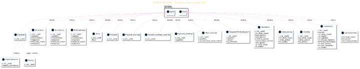

&nbsp;

&nbsp;

&nbsp;

&nbsp;

<h1><a name="_Toc230901465">10. ESPECIFICACIÓN DE
REQUISITOS</a></h1>

&nbsp;

A continuación, mediante los <b>diagramas de casos de uso</b>,
se describe las acciones principales que los usuarios de la aplicación pueden
realizar.

Se presenta una <strong>descripción detallada de los
casos de uso</strong> de <em><b>SPACE
ESCAPE</b></em>, acompañada de <strong>diagramas
UML en PlantUML</strong>. Se ha distribuido los casos de uso en <strong>actores</strong>, <strong>casos de uso principales</strong>,
<strong>casos extendidos</strong>,
y un <strong>diagrama
completo</strong>.

<h2><a name="_Toc230901466">10</a><strong>.1. Actores del sistema</strong></h2>

·&nbsp;&nbsp;&nbsp;&nbsp;&nbsp;&nbsp;&nbsp;
<strong>Jugador</strong> — Usuario
principal que controla al personaje.

·&nbsp;&nbsp;&nbsp;&nbsp;&nbsp;&nbsp;&nbsp;
<strong>Sistema
del juego</strong>
— Motor que gestiona niveles, físicas, enemigos y eventos.

·&nbsp;&nbsp;&nbsp;&nbsp;&nbsp;&nbsp;&nbsp;
<strong>Enemigos</strong> — Entidades
autónomas que reaccionan al jugador.

·&nbsp;&nbsp;&nbsp;&nbsp;&nbsp;&nbsp;&nbsp;
<strong>Entorno</strong> —
Plataformas, ascensores, teletransportadores.

<h2><a name="_Toc230901467">10<strong>.2. Casos de uso principales</strong></a></h2>

A
continuación se describen las acciones principales que el usuario puede
realizar dentro del juego.

<h3><a name="_Toc230901468">10<strong>.2.1.
Controlar al personaje</strong></a></h3>

<strong>Actor:</strong> Jugador 

<strong>Descripción:</strong> El jugador
mueve, salta, dispara y realiza acciones básicas.

Incluye:

·&nbsp;&nbsp;&nbsp;&nbsp;&nbsp;&nbsp;&nbsp;
Moverse

·&nbsp;&nbsp;&nbsp;&nbsp;&nbsp;&nbsp;&nbsp;
Saltar

·&nbsp;&nbsp;&nbsp;&nbsp;&nbsp;&nbsp;&nbsp;
Disparar

·&nbsp;&nbsp;&nbsp;&nbsp;&nbsp;&nbsp;&nbsp;
Interactuar

<h3><a name="_Toc230901469">10<strong>.2.2.
Explorar niveles</strong></a></h3>

<strong>Actor:</strong> Jugador 

<strong>Descripción:</strong> El jugador
recorre escenarios, descubre rutas y evita peligros.

Incluye:

·&nbsp;&nbsp;&nbsp;&nbsp;&nbsp;&nbsp;&nbsp;
Usar
plataformas

·&nbsp;&nbsp;&nbsp;&nbsp;&nbsp;&nbsp;&nbsp;
Usar
ascensores

·&nbsp;&nbsp;&nbsp;&nbsp;&nbsp;&nbsp;&nbsp;
Usar
teletransportadores

<h3><a name="_Toc230901470">10<strong>.2.3.
Enfrentar enemigos</strong></a></h3>

<strong>Actor:</strong> Jugador 

<strong>Descripción:</strong> El jugador
combate enemigos mediante disparos o evasión.

Incluye:

·&nbsp;&nbsp;&nbsp;&nbsp;&nbsp;&nbsp;&nbsp;
Atacar
enemigo

·&nbsp;&nbsp;&nbsp;&nbsp;&nbsp;&nbsp;&nbsp;
Esquivar
ataques

Extiende:

·&nbsp;&nbsp;&nbsp;&nbsp;&nbsp;&nbsp;&nbsp;
Derrotar
enemigo final

<h3><a name="_Toc230901471">10<strong>.2.4.
Activar mecanismos</strong></a></h3>

<strong>Actor:</strong> Jugador 

<strong>Descripción:</strong> El jugador
activa teletransportador, cambia de fases.

Incluye:

·&nbsp;&nbsp;&nbsp;&nbsp;&nbsp;&nbsp;&nbsp;
Activar
teletransportador

·&nbsp;&nbsp;&nbsp;&nbsp;&nbsp;&nbsp;&nbsp;
Acceder
a fases

<h3><a name="_Toc230901472">10<strong>.2.5.
Gestionar recursos</strong></a></h3>

<strong>Actor:</strong> Jugador 

<strong>Descripción:</strong> El jugador
recoge gemas y gestiona su inventario básico.

Incluye:

·&nbsp;&nbsp;&nbsp;&nbsp;&nbsp;&nbsp;&nbsp;
Recoger
gemas

·&nbsp;&nbsp;&nbsp;&nbsp;&nbsp;&nbsp;&nbsp;
Usar
mejora salud

<h3><a name="_Toc230901473">10<strong>.2.6.
Progresar en la historia</strong></a></h3>

<strong>Actor:</strong> Jugador 

<strong>Descripción:</strong> El jugador
avanza entre niveles hasta escapar del planeta.

Incluye:

·&nbsp;&nbsp;&nbsp;&nbsp;&nbsp;&nbsp;&nbsp;
Completar
nivel

·&nbsp;&nbsp;&nbsp;&nbsp;&nbsp;&nbsp;&nbsp;
Desbloquear
nueva zona

&nbsp;

<h2><a name="_Toc230901474">10<strong>.3. Diagrama UML de Casos de
Uso (PlantUML)</strong></a></h2>

A continuación vemos el diagrama UML de los Casos de uso del
videojuego:

@startuml

title SPACE
ESCAPE - Diagrama de Casos de Uso

&nbsp;

left to right
direction

skinparam
actorStyle awesome

&nbsp;

actor
&quot;Jugador&quot; as Player

actor
&quot;Sistema del Juego&quot; as System

&nbsp;

rectangle
&quot;SPACE ESCAPE&quot; {

&nbsp;

  (Moverse) as
Move

  (Saltar) as
Jump

  (Disparar)
as Shoot

 
(Interactuar) as Interact

  (Explorar Nivel)
as Explore

  (Usar
Plataforma) as Platform

  (Usar
Ascensor) as Elevator

  (Usar
Teletransportador) as Teleport

  (Atacar
Enemigo) as Attack

  (Esquivar
Ataques) as Dodge

  (Derrotar
Nave Final) as Boss

  (Recoger
Gema) as Item

  (Usar Mejora
Temporal de Salud) as PowerUp

  (Completar
Nivel) as FinishLevel

  (Desbloquear
Nueva Fase) as UnlockZone

&nbsp;

  Player
--&gt; Move

  Player
--&gt; Jump

  Player
--&gt; Shoot

  Player
--&gt; Interact

&nbsp;

  Player
--&gt; Explore

  Explore
--&gt; Platform

  Explore
--&gt; Elevator

  Explore --&gt;
Teleport

&nbsp;

  Player
--&gt; Attack

  Player
--&gt; Dodge

  Attack
--&gt; Boss

&nbsp;

  Player
--&gt; Item

  Item --&gt;
PowerUp

&nbsp;

  Player
--&gt; FinishLevel

  FinishLevel
--&gt; UnlockZone

&nbsp;

  System
--&gt; Boss : &quot;Controla IA&quot;

  System
--&gt; Attack : &quot;Genera enemigos&quot;

  System
--&gt; Explore : &quot;Gestiona entorno&quot;

}

@enduml

&nbsp;

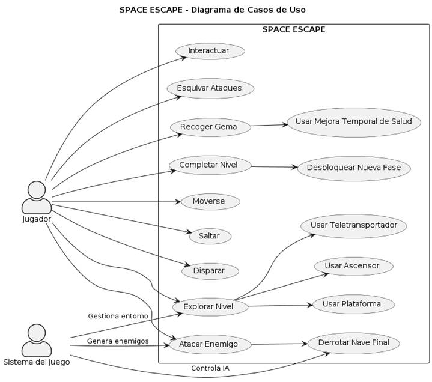

&nbsp;

&nbsp;

&nbsp;

<h1><a name="_Toc231174619">11. IMPLEMENTACIÓN</a> </h1>

&nbsp;

Para
completar este apartado se ha realizado una documentación de la aplicación
donde se han detallado sus clases principales (clases de lógica de negocio) y
su funcionalidad y las estructuras de datos utilizadas para almacenar la
información que maneja la aplicación. 

Esto
se ha realizado mediante los comentarios del código fuente para la generación
de la documentación. 

Se localiza
en el directorio correspondiente del proyecto.

<h2><a name="_Toc231174620">11</a>.1. Estructura del Proyecto</h2>

<pre><code>/assets</code></pre><pre><code>        /debug</code></pre><pre><code>        /img</code></pre><pre><code>        /levels</code></pre><pre><code>        /music</code></pre><pre><code>        /sprites</code></pre><pre><code>        /videos</code></pre><pre><code>/docs</code></pre><pre><code>    gdd.md </code></pre><pre><code>    memory.md</code></pre><pre><code>/src</code></pre><pre><code>    /carácter</code>/    &#8594; Clases que implementan los elementos del juego.</pre>

<code>    /gui/       </code>&#8594;
Clases que implementan los menus del juego

<code>    /webhook</code>

<code>    main.py </code>&#8594;
Archivo que ejecuta el juego

<pre><code>README.md</code></pre><pre><code>requirements.txt</code></pre>

&nbsp;

<h2><a name="_Toc231174621">11.2. Contenido de la documentación</a></h2>

&nbsp;

Cada
clase incluye:

Descripción
general

Atributos
con explicación

Los
métodos públicos contienen:

1.&nbsp;&nbsp;&nbsp;&nbsp;&nbsp;
Propósito

2.&nbsp;&nbsp;&nbsp;&nbsp;&nbsp;
Parámetros

3.&nbsp;&nbsp;&nbsp;&nbsp;&nbsp;
Valor devuelto

4.&nbsp;&nbsp;&nbsp;&nbsp;&nbsp;
Excepciones

&nbsp;

<h1><a name="_Toc231174622">12. MANUAL DE USUARIO (DESCRIPCIÓN DEL
FUNCIONAMIENTO)</a> </h1>

&nbsp;

En este apartado se<i> </i>explica cómo
interactúa un usuario con el videojuego. 

<i>&nbsp;</i>

Se ha capturado las pantallas del videojuego y se
muestra el funcionamiento de las distintas opciones, mensajes de error, etc.

&nbsp;

Nota: Para arrancar la aplicación es necesario
elegir “Run Python File in Terminal” sobre la clase principal main.py.

&nbsp;

<h2><a name="_Toc231174623">12.1. Pantalla 1: Título y menú principal</a></h2>

<b>Objetivo:</b> punto de
entrada al juego y acceso a las opciones básicas.

<b>Elementos en pantalla:</b>

•&nbsp;&nbsp;&nbsp;&nbsp;&nbsp;&nbsp; <b>Logo del
juego:</b>
“SPACE ESCAPE” en grande, estilo árcade, centrado.

•&nbsp;&nbsp;&nbsp;&nbsp;&nbsp;&nbsp; <b>Fondo
animado:</b>
planetas alienígenas, estrellas, naves.

•&nbsp;&nbsp;&nbsp;&nbsp;&nbsp;&nbsp; <b>Menú
principal (lista):</b>

•&nbsp;&nbsp;&nbsp;&nbsp;&nbsp;&nbsp; <b>Jugar</b>

•&nbsp;&nbsp;&nbsp;&nbsp;&nbsp;&nbsp; <b>Créditos</b>

•&nbsp;&nbsp;&nbsp;&nbsp;&nbsp;&nbsp; <b>Instrucciones</b>

•&nbsp;&nbsp;&nbsp;&nbsp;&nbsp;&nbsp; <b>Niveles</b> (si está
desbloqueado)

•&nbsp;&nbsp;&nbsp;&nbsp;&nbsp;&nbsp; <b>Salir</b> 

<b>Interacción del usuario:</b>

•&nbsp;&nbsp;&nbsp;&nbsp;&nbsp;&nbsp; <b>Ratón:</b>

•&nbsp;&nbsp;&nbsp;&nbsp;&nbsp;&nbsp; <b>Arriba/abajo:</b> desplaza el
cursor por las opciones.

•&nbsp;&nbsp;&nbsp;&nbsp;&nbsp;&nbsp; <b>Clica botón
izquierdo:</b>
confirma opción.

•&nbsp;&nbsp;&nbsp;&nbsp;&nbsp;&nbsp; <b>Salir:</b> Si clica en
este botón sale de la aplicación.

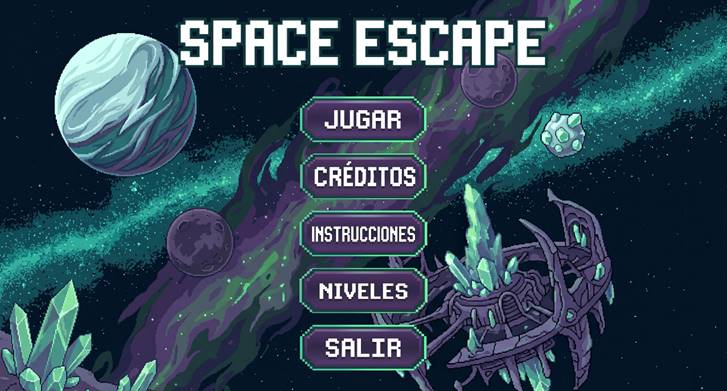

&nbsp;

<h2><a name="_Toc231174624">12.2. Pantalla 2: Pantalla de créditos</a></h2>

<b>Objetivo:</b> mostrar los
autores.

<b>Formato:</b>

•&nbsp;&nbsp;&nbsp;&nbsp;&nbsp;&nbsp; Ventana con
información textual sobre los autores del juego.

<b>Interacción del usuario:</b>

•&nbsp;&nbsp;&nbsp;&nbsp;&nbsp;&nbsp; Cerrar la
ventana mediante el boton &quot;ATRÁS&quot;.

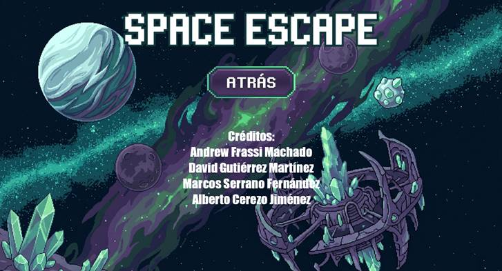

&nbsp;

<h2><a name="_Toc231174625">12.3. Pantalla 3: Pantalla de instrucciones</a></h2>

<b>Objetivo:</b> enseñar al
jugador las mecánicas del juego.

<b>Formato:</b>

•&nbsp;&nbsp;&nbsp;&nbsp;&nbsp;&nbsp; Ventanas con
instrucciones textuales sobre el juego.

•&nbsp;&nbsp;&nbsp;&nbsp;&nbsp;&nbsp; Ejemplos:

•&nbsp;&nbsp;&nbsp;&nbsp;&nbsp;&nbsp; “Moverse:
flechas del teclado y &quot;

•&nbsp;&nbsp;&nbsp;&nbsp;&nbsp;&nbsp; &quot;W(saltar/subir escalera), S(bajar escalera), ”

•&nbsp;&nbsp;&nbsp;&nbsp;&nbsp;&nbsp; “Disparar:
espacio y Q.”

<b>Interacción del usuario:</b>

•&nbsp;&nbsp;&nbsp;&nbsp;&nbsp;&nbsp; Cerrar la
ventana mediante el boton &quot;ATRÁS&quot;.

&nbsp;

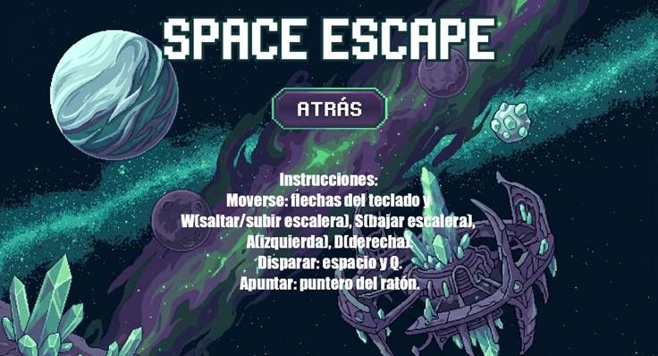

<h2><a name="_Toc231174626">12.4. Pantalla 4: Selección de nivel</a></h2>

<b>Objetivo:</b> permitir al
jugador elegir en qué zona del planeta jugar.

<b>Elementos en pantalla:</b>

•&nbsp;&nbsp;&nbsp;&nbsp;&nbsp;&nbsp; <b>Lista de
niveles:</b>

•&nbsp;&nbsp;&nbsp;&nbsp;&nbsp;&nbsp; NIVEL 1 (Zona
de abducción)

•&nbsp;&nbsp;&nbsp;&nbsp;&nbsp;&nbsp; NIVEL 2 (Zona
de aterrizaje)

•&nbsp;&nbsp;&nbsp;&nbsp;&nbsp;&nbsp; NIVEL 3
(Zonas de obras)

•&nbsp;&nbsp;&nbsp;&nbsp;&nbsp;&nbsp;
NIVEL
4 (Laboratorio abandonado)

•&nbsp;&nbsp;&nbsp;&nbsp;&nbsp;&nbsp;
NIVEL
FINAL (Base de lanzamiento alienígena)

<b>Interacción del usuario:</b>

•&nbsp;&nbsp;&nbsp;&nbsp;&nbsp;&nbsp; <b>Movimiento
del raton:</b>
seleccionar un nivel.

•&nbsp;&nbsp;&nbsp;&nbsp;&nbsp;&nbsp; <b>Click del
raton:</b>
iniciar el nivel seleccionado (si está desbloqueado).

•&nbsp;&nbsp;&nbsp;&nbsp;&nbsp;&nbsp; <b>Boton volver
atras:</b>
volver al menú principal.

&nbsp;

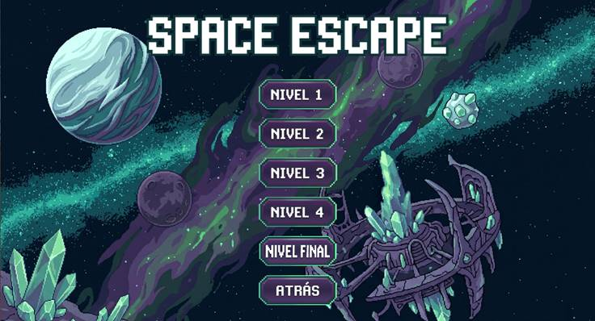

&nbsp;

<h2><a name="_Toc231174627">12.5. Pantalla 5: Juego en curso (HUD in-game)</a></h2>

<b>Objetivo:</b> mostrar la
acción del juego y la información mínima necesaria.

<b>Elementos del HUD:</b>

•&nbsp;&nbsp;&nbsp;&nbsp;&nbsp;&nbsp; <b>Barra de
vida:</b>
esquina superior izquierda.

•&nbsp;&nbsp;&nbsp;&nbsp;&nbsp;&nbsp; <b>Progreso del
nivel:</b>

•&nbsp;&nbsp;&nbsp;&nbsp;&nbsp;&nbsp; Pequeño
indicador (ej.: “Score: 10”, “Gemas azules: 1”, etc...)

<b>Interacción del usuario:</b>

•&nbsp;&nbsp;&nbsp;&nbsp;&nbsp;&nbsp; <b>Movimiento:</b>
izquierda/derecha y teclas A y D.

•&nbsp;&nbsp;&nbsp;&nbsp;&nbsp;&nbsp; <b>Salto:</b> botón
asignado fecha hacia arriba y tecla W.

•&nbsp;&nbsp;&nbsp;&nbsp;&nbsp;&nbsp; <b>Disparo:</b> botón
asignado Espacio.

<b>Interacción:</b> acción cerca
de objetos (teletransportadores).

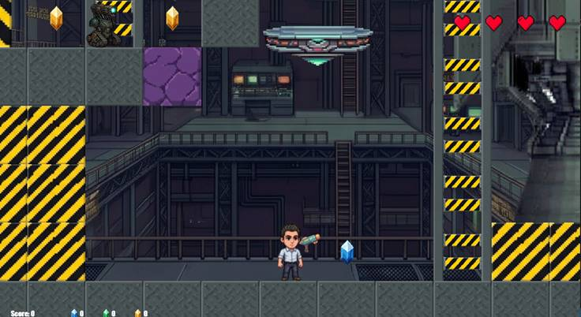

&nbsp;

<h3><a name="_Toc231174628">12.5.1. Pantalla
5.1: NIVEL 1</a></h3>

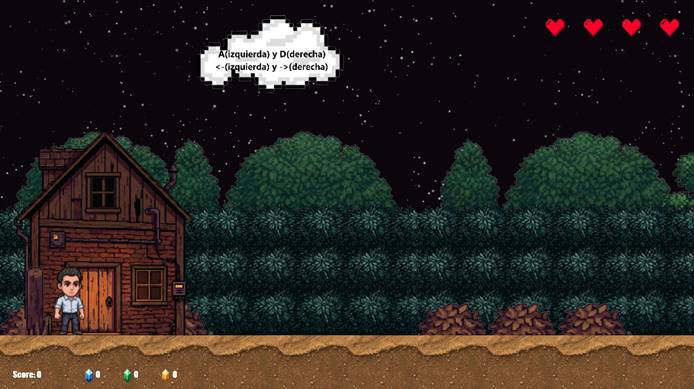

<h4>Pantalla 5.1.1: NIVEL 1.1</h4>

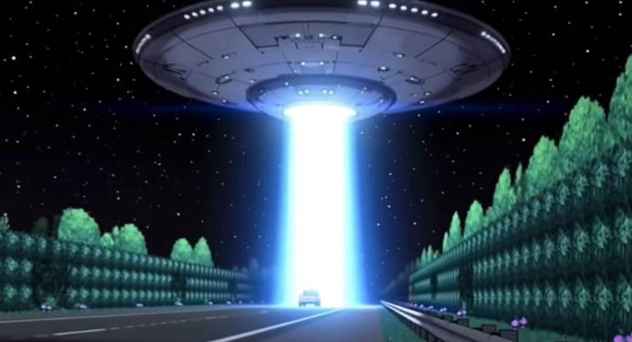

<b><i>&nbsp;</i></b>

<h3><a name="_Toc231174629">12.5.2. Pantalla
5.2: NIVEL 2</a></h3>

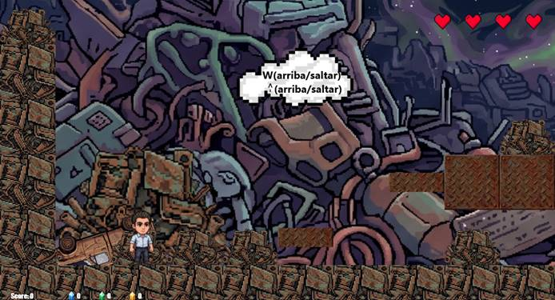

<b><i>&nbsp;</i></b>

<h4>Pantalla 5.2.1: REGOGIDA
ARMA</h4>

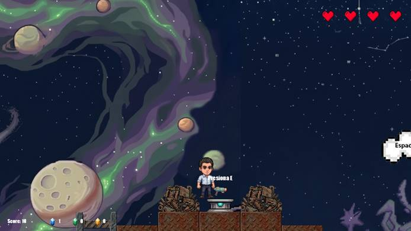

<h3>&nbsp;</h3>

<h3><a name="_Toc231174630">12.5.3. Pantalla
5.3: NIVEL 3</a></h3>

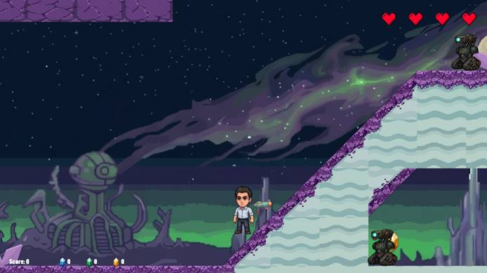

<h4>Pantalla 5.3.1: GRUA/OBRAS</h4>

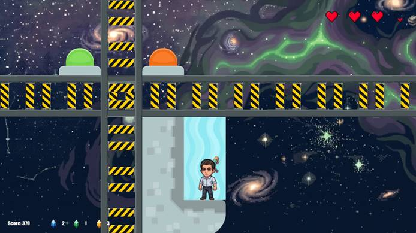

<b><i>&nbsp;</i></b>

<h3><a name="_Toc231174631">12.5.4. Pantalla
5.4: NIVEL 4</a></h3>

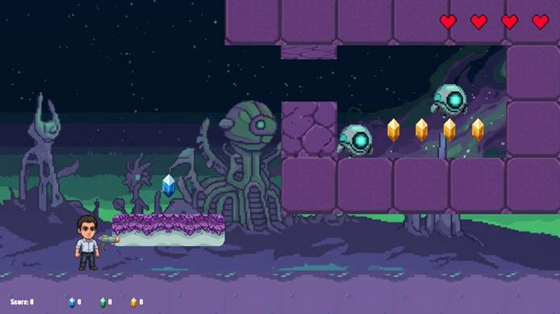

<h4>Pantalla 5.4.1: LABORATORIO</h4>

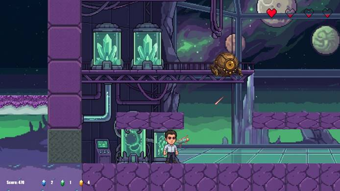

&nbsp;

<h3><a name="_Toc231174632">12.5.5. Pantalla
5.5: NIVEL FINAL</a></h3>

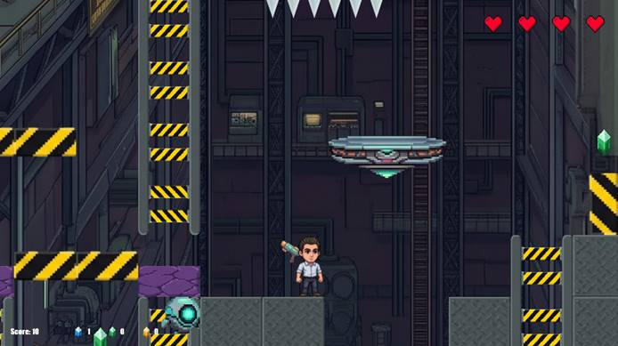

<h4>Pantalla 5.5.1:
ENFRENTAMIENTO FINAL</h4>

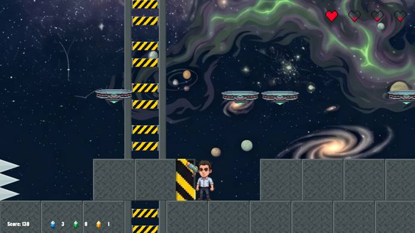

&nbsp;

&nbsp;

<h2><a name="_Toc231174633">12.6. Pantalla 6: Game Over</a></h2>

<b>Objetivo:</b> informar que
el jugador ha perdido y ofrecer opciones de reintentar nivel.

<b>Elementos:</b>

•&nbsp;&nbsp;&nbsp;&nbsp;&nbsp;&nbsp; Texto central
grande: <b>“GAME OVER”</b>.

•&nbsp;&nbsp;&nbsp;&nbsp;&nbsp;&nbsp; Opciones:

•&nbsp;&nbsp;&nbsp;&nbsp;&nbsp;&nbsp; <b>Reintentar
nivel</b>

<b>Interacción del usuario:</b>

•&nbsp;&nbsp;&nbsp;&nbsp;&nbsp;&nbsp; Clicar botón
izquierdo ratón para reiniciar el nivel.

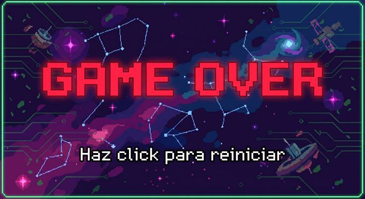

&nbsp;

<h2><a name="_Toc231174634">12.7. Pantalla 7: Pantalla de victoria / fin de
nivel</a></h2>

<b><i>&nbsp;</i></b>

<b>Objetivo:</b> celebrar la
victoria del jugador, mostrar el regreso del protagonista a la tierra.

<b>Elementos:</b>

•&nbsp;&nbsp;&nbsp;&nbsp;&nbsp;&nbsp; Texto: <b>“¡VICTORIA”</b>.

•&nbsp;&nbsp;&nbsp;&nbsp;&nbsp;&nbsp; Cinemática
breve que muestra al personaje regresando a la tierra.

•&nbsp;&nbsp;&nbsp;&nbsp;&nbsp;&nbsp; Botones:

•&nbsp;&nbsp;&nbsp;&nbsp;&nbsp;&nbsp; <b>Click para
volver al menú principal.</b>

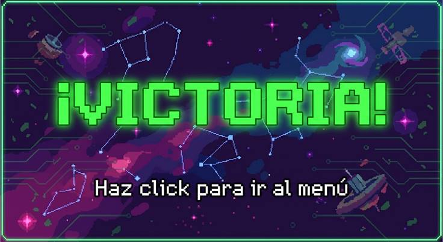

&nbsp;

&nbsp;

<h1><a name="_Toc231174635">13.
PROYECTO</a> </h1>

Acompañando
a la memoria del proyecto, se incluye un proyecto listo para arrancar la
aplicación, para comprobar que se cumplen las especificaciones formuladas. 

Se
ha comprimido en un fichero indicando el primer apellido de los autores y el
curso 25_26.

&nbsp;

&nbsp;

</body>

</html>
